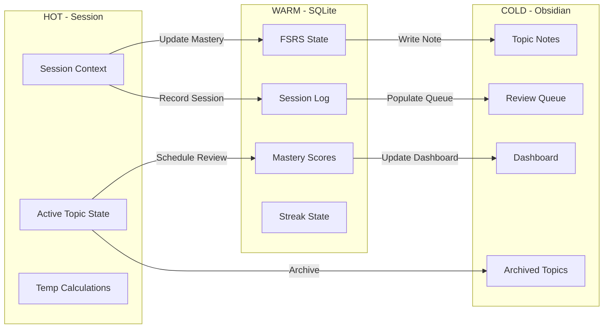
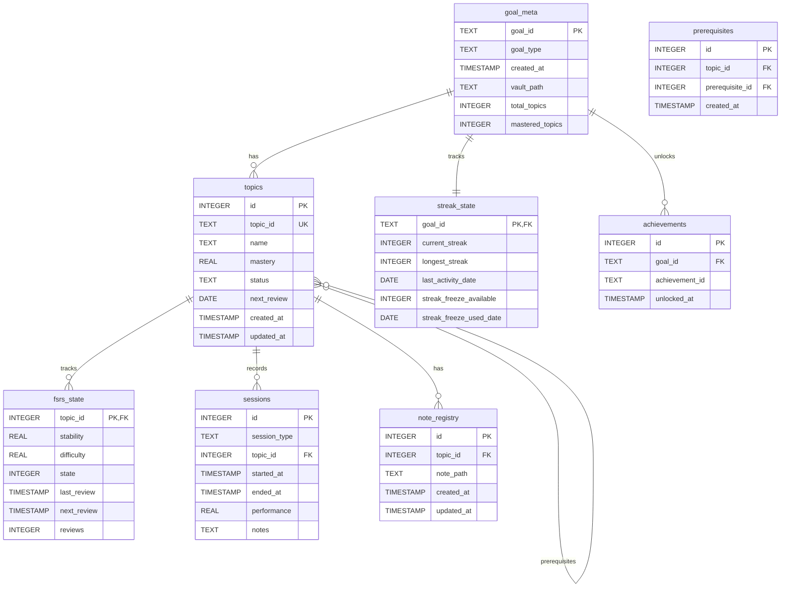
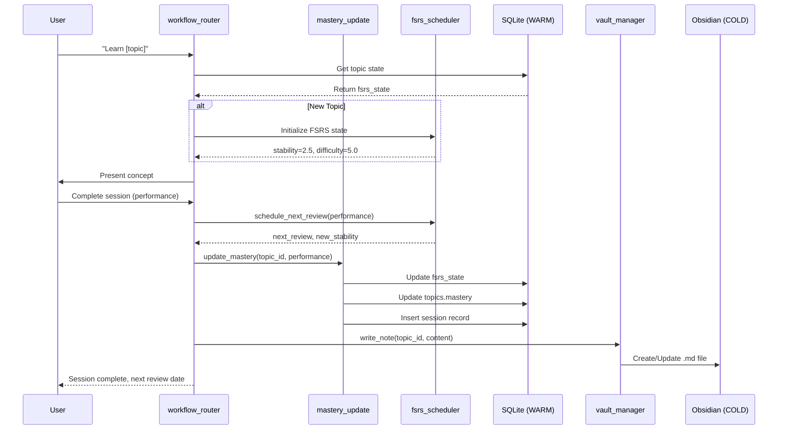
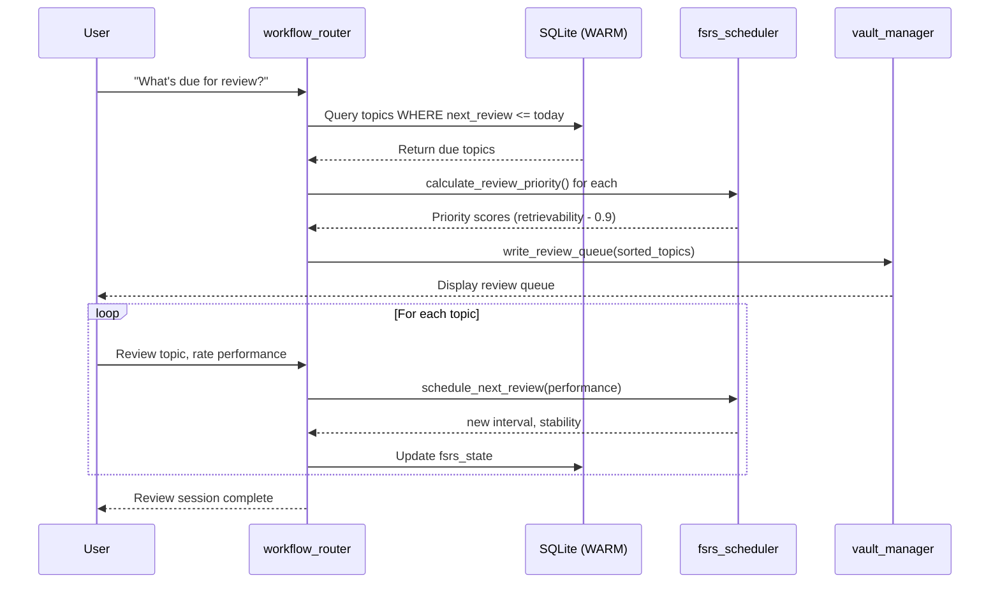
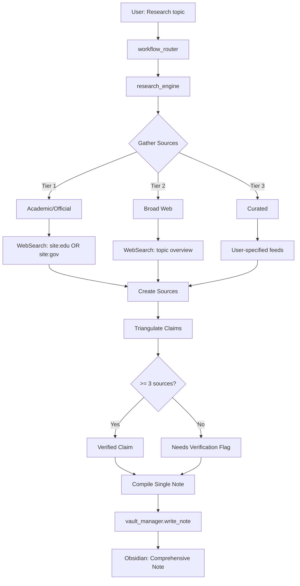
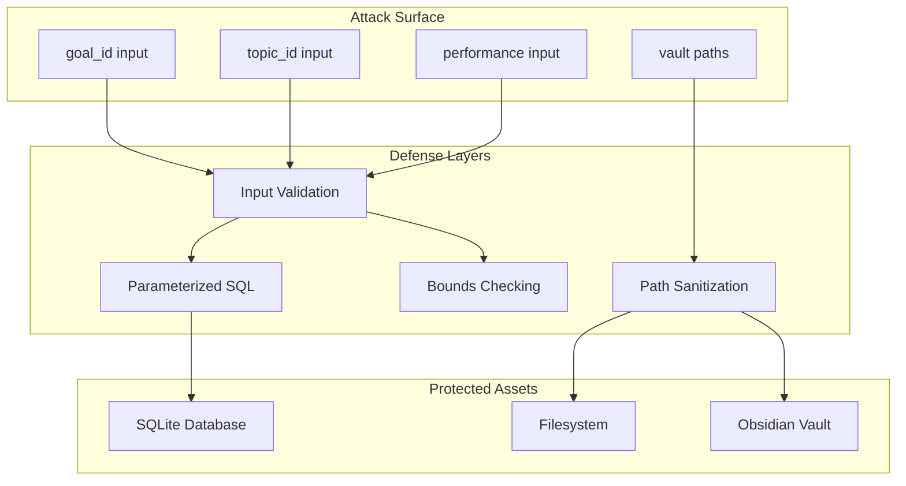
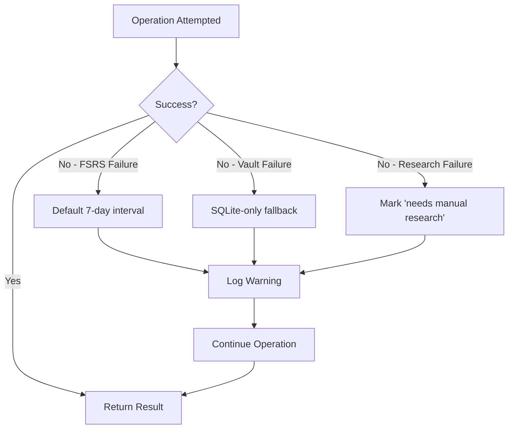

# MIT Learning Skill Architecture

## 1. Three-Tier Memory Architecture

```
┌─────────────────────────────────────────────────────────────────────┐
│                        MEMORY TIERS                                  │
├─────────────────────────────────────────────────────────────────────┤
│                                                                      │
│  ┌──────────────┐   ┌──────────────┐   ┌──────────────────────┐    │
│  │     HOT      │   │     WARM     │   │        COLD           │    │
│  │   Session    │ → │    SQLite    │ → │      Obsidian        │    │
│  │   Context    │   │  memory.db   │   │       Vault          │    │
│  └──────────────┘   └──────────────┘   └──────────────────────┘    │
│                                                                      │
│  Latency: 0ms           Latency: 1-5ms       Latency: 10-50ms      │
│  Duration: Session      Duration: Permanent   Duration: Permanent    │
│  Storage: RAM          Storage: Disk         Storage: Markdown     │
│                                                                      │
└─────────────────────────────────────────────────────────────────────┘
```

### Tier Characteristics

| Tier | Storage | Latency | Persistence | Use Case |
|------|---------|---------|-------------|----------|
| **HOT** | In-memory (session context) | 0ms | Session lifetime | Active learning session state, temporary calculations |
| **WARM** | SQLite (`~/.mit-learning/goals/{goal_id}/memory.db`) | 1-5ms | Permanent | FSRS state, mastery tracking, session history |
| **COLD** | Obsidian vault (`~/Obsidian/MIT-{goal-slug}/`) | 10-50ms | Permanent | Comprehensive notes, knowledge graph, reviewed content |

### Data Flow Between Tiers



---

## 2. Module Architecture

```
┌─────────────────────────────────────────────────────────────────────┐
│                         MODULE LAYOUT                                │
├─────────────────────────────────────────────────────────────────────┤
│                                                                      │
│                    ┌──────────────────┐                             │
│                    │  workflow_router  │                             │
│                    │   (Entry Point)   │                             │
│                    └────────┬─────────┘                             │
│                             │                                        │
│          ┌──────────────────┼──────────────────┐                    │
│          ▼                  ▼                  ▼                    │
│   ┌────────────┐    ┌────────────┐    ┌────────────┐               │
│   │  learning  │    │   review   │    │  practice  │               │
│   │  workflow  │    │  workflow  │    │  workflow  │               │
│   └─────┬──────┘    └─────┬──────┘    └─────┬──────┘               │
│         │                 │                 │                        │
│         └─────────────────┼─────────────────┘                        │
│                           ▼                                          │
│    ┌────────────────────────────────────────────────────┐           │
│    │                  CORE MODULES                       │           │
│    ├────────────────────────────────────────────────────┤           │
│    │                                                    │           │
│    │  ┌─────────────┐  ┌──────────────┐  ┌───────────┐ │           │
│    │  │sqlite_init  │  │fsrs_scheduler│  │validation │ │           │
│    │  │             │  │              │  │           │ │           │
│    │  │ - DB create │  │ - FSRS-6    │  │ - Path    │ │           │
│    │  │ - Schema    │  │ - Schedule  │  │   check   │ │           │
│    │  │ - Indexes   │  │ - Mastery   │  │ - Bounds  │ │           │
│    │  └─────────────┘  └──────────────┘  └───────────┘ │           │
│    │                                                    │           │
│    │  ┌─────────────┐  ┌──────────────┐  ┌───────────┐ │           │
│    │  │mastery_     │  │vault_manager │  │research_  │ │           │
│    │  │update       │  │              │  │engine     │ │           │
│    │  │             │  │ - Notes      │  │           │ │           │
│    │  │ - Progress  │  │ - Dashboard  │  │ - Tiered  │ │           │
│    │  │ - Streak    │  │ - Archive    │  │ - Claims  │ │           │
│    │  │ - Freeze    │  │ - Queue      │  │ - Sources │ │           │
│    │  └─────────────┘  └──────────────┘  └───────────┘ │           │
│    │                                                    │           │
│    └────────────────────────────────────────────────────┘           │
│                                                                      │
│    ┌────────────────────────────────────────────────────┐           │
│    │               achievement_engine                   │           │
│    │   (Future: Unlock logic, badge system)             │           │
│    └────────────────────────────────────────────────────┘           │
│                                                                      │
└─────────────────────────────────────────────────────────────────────┘
```

### Module Responsibilities

| Module | File | Responsibility |
|--------|------|----------------|
| **workflow_router** | `scripts/workflow_router.py` | Intent analysis, workflow dispatch |
| **sqlite_init** | `scripts/sqlite_init.py` | Database creation, schema initialization |
| **fsrs_scheduler** | `scripts/fsrs_scheduler.py` | FSRS-6 scheduling, mastery calculation |
| **mastery_update** | `scripts/mastery_update.py` | Progress tracking, streak management |
| **vault_manager** | `scripts/vault_manager.py` | Obsidian vault operations, note writing |
| **research_engine** | `scripts/research_engine.py` | Tiered research, claim triangulation |
| **validation** | `scripts/validation.py` | Input sanitization, path traversal prevention |
| **achievement_engine** | `scripts/achievement_engine.py` | Achievement unlock logic (future) |

---

## 3. Database Schema

### Entity Relationship Diagram



### Complete Table Definitions

#### `goal_meta`
```sql
CREATE TABLE goal_meta (
    goal_id TEXT PRIMARY KEY,
    goal_type TEXT NOT NULL,           -- exam|skill|degree|topic
    created_at TIMESTAMP DEFAULT CURRENT_TIMESTAMP,
    vault_path TEXT,                   -- Path to Obsidian vault
    total_topics INTEGER DEFAULT 0,
    mastered_topics INTEGER DEFAULT 0
);
```

#### `topics`
```sql
CREATE TABLE topics (
    id INTEGER PRIMARY KEY AUTOINCREMENT,
    topic_id TEXT UNIQUE NOT NULL,     -- e.g., 'T01-intro-python'
    name TEXT NOT NULL,                -- Display name
    mastery REAL DEFAULT 0.0,         -- 0.0 to 1.0
    status TEXT DEFAULT 'pending',     -- pending|in_progress|mastered
    next_review DATE,
    created_at TIMESTAMP DEFAULT CURRENT_TIMESTAMP,
    updated_at TIMESTAMP DEFAULT CURRENT_TIMESTAMP
);
```

#### `fsrs_state`
```sql
CREATE TABLE fsrs_state (
    topic_id INTEGER PRIMARY KEY,
    stability REAL DEFAULT 2.5,        -- Days until 90% retention
    difficulty REAL DEFAULT 5.0,       -- 1-10 scale
    state INTEGER DEFAULT 0,           -- 0=New, 1=Learning, 2=Review, 3=Relearning
    last_review TIMESTAMP,
    next_review TIMESTAMP,
    reviews INTEGER DEFAULT 0,
    FOREIGN KEY (topic_id) REFERENCES topics(id)
);
```

#### `sessions`
```sql
CREATE TABLE sessions (
    id INTEGER PRIMARY KEY AUTOINCREMENT,
    session_type TEXT NOT NULL,        -- review|practice|assessment
    topic_id INTEGER,
    started_at TIMESTAMP DEFAULT CURRENT_TIMESTAMP,
    ended_at TIMESTAMP,
    performance REAL,                  -- 0.0 to 1.0
    notes TEXT,
    FOREIGN KEY (topic_id) REFERENCES topics(id)
);
```

#### `prerequisites`
```sql
CREATE TABLE prerequisites (
    id INTEGER PRIMARY KEY AUTOINCREMENT,
    topic_id INTEGER NOT NULL,
    prerequisite_id INTEGER NOT NULL,
    created_at TIMESTAMP DEFAULT CURRENT_TIMESTAMP,
    FOREIGN KEY (topic_id) REFERENCES topics(id),
    FOREIGN KEY (prerequisite_id) REFERENCES topics(id),
    UNIQUE(topic_id, prerequisite_id)
);
```

#### `note_registry`
```sql
CREATE TABLE note_registry (
    id INTEGER PRIMARY KEY AUTOINCREMENT,
    topic_id INTEGER NOT NULL,
    note_path TEXT NOT NULL,           -- Path to .md file in vault
    created_at TIMESTAMP DEFAULT CURRENT_TIMESTAMP,
    updated_at TIMESTAMP DEFAULT CURRENT_TIMESTAMP,
    FOREIGN KEY (topic_id) REFERENCES topics(id)
);
```

#### `streak_state`
```sql
CREATE TABLE streak_state (
    goal_id TEXT PRIMARY KEY,
    current_streak INTEGER DEFAULT 0,
    longest_streak INTEGER DEFAULT 0,
    last_activity_date DATE,
    streak_freeze_available INTEGER DEFAULT 1,
    streak_freeze_used_date DATE,
    FOREIGN KEY (goal_id) REFERENCES goal_meta(goal_id)
);
```

#### `achievements`
```sql
CREATE TABLE achievements (
    id INTEGER PRIMARY KEY AUTOINCREMENT,
    goal_id TEXT NOT NULL,
    achievement_id TEXT NOT NULL,      -- e.g., 'first-session', '7-day-streak'
    unlocked_at TIMESTAMP DEFAULT CURRENT_TIMESTAMP,
    FOREIGN KEY (goal_id) REFERENCES goal_meta(goal_id),
    UNIQUE(goal_id, achievement_id)
);
```

---

## 4. Data Flow Diagrams

### Learning Session Flow



### Review Session Flow



### Research Flow



---

## 5. Security Considerations

### Threat Model



### Path Traversal Prevention

**Threat:** User-supplied `goal_id` or `topic_id` containing `../` could access files outside intended directories.

**Defense:** Safe identifier pattern validation.

```python
# scripts/validation.py
SAFE_ID_PATTERN = re.compile(r'^[a-zA-Z0-9-_]+$')

def validate_goal_id(goal_id: str) -> str:
    if not goal_id:
        raise ValidationError("E004", "goal_id cannot be empty")
    
    if not SAFE_ID_PATTERN.match(goal_id):
        raise ValidationError("E004", f"Invalid goal_id format: {goal_id!r}")
    
    if len(goal_id) > 64:
        raise ValidationError("E004", f"goal_id too long: {len(goal_id)} chars")
    
    return goal_id
```

**Blocked patterns:**
- `../` (directory traversal)
- `/` (absolute path)
- `\` (Windows path)
- `.` (hidden files)
- Special characters: `< > : " | ? *`
- Null bytes, control characters

### SQL Injection Prevention

**Threat:** Malicious input in identifiers could execute arbitrary SQL.

**Defense:** Parameterized queries throughout.

```python
# CORRECT: Parameterized query
cursor.execute("""
    SELECT * FROM topics WHERE topic_id = ?
""", (topic_id,))

# WRONG: String interpolation (vulnerable)
cursor.execute(f"SELECT * FROM topics WHERE topic_id = '{topic_id}'")
```

**All database operations use parameterized queries:**
- `sqlite_init.py`: Table creation, inserts
- `mastery_update.py`: Updates, selects
- `vault_manager.py`: None (filesystem only)

### Input Validation Matrix

| Input | Validation | Error Code | File |
|-------|------------|------------|------|
| `goal_id` | SAFE_ID_PATTERN, length ≤64 | E004 | validation.py |
| `goal_type` | Enum: exam/skill/degree/topic | E005 | validation.py |
| `topic_id` | SAFE_ID_PATTERN, length ≤128 | E302 | validation.py |
| `performance` | Numeric, 0.0 ≤ x ≤ 1.0 | E203 | validation.py |
| `stability` | Non-negative if provided | E201 | validation.py |

### Bounds Checking

**FSRS Parameter Bounds:**

```python
# scripts/fsrs_scheduler.py
MAX_STABILITY = 365.0   # 1 year maximum
MAX_INTERVAL = 365      # Cap review interval

def schedule_next_review(...):
    # Cap stability
    stability = min(stability, MAX_STABILITY)
    
    # Clamp interval
    interval_days = max(1, min(MAX_INTERVAL, interval_days))
```

**Prevents:**
- Integer overflow from extreme values
- Unreasonable review intervals (decades)
- Memory exhaustion from large calculations

### Graceful Degradation



| Failure Mode | Fallback | User Impact |
|--------------|----------|-------------|
| FSRS calculation error | Default 7-day review interval | Learning continues, suboptimal scheduling |
| Vault write failure | SQLite-only storage | Notes not in Obsidian, DB intact |
| Research source unavailable | Flag claim as unverified | User knows to verify manually |
| Database locked | Retry with exponential backoff (3x) | Brief delay, then operation proceeds |

### Error Code Summary

| Range | Category | Example |
|-------|----------|---------|
| E001-E099 | Input Errors | E004: Invalid goal_id |
| E101-E199 | State Errors | E102: Goal count limit exceeded |
| E201-E299 | Calculation Errors | E203: Invalid performance |
| E301-E399 | Vault Errors | E302: Invalid topic_id |
| E501-E599 | System Errors | E601: Research contradiction detected |

---

**Document Version:** 1.0.0
**Last Updated:** 2026-09-01
**Related:** [FSRS-6 Algorithm](FSRS-6-ALGORITHM.md) | [Error Handling](ERROR-HANDLING.md)
