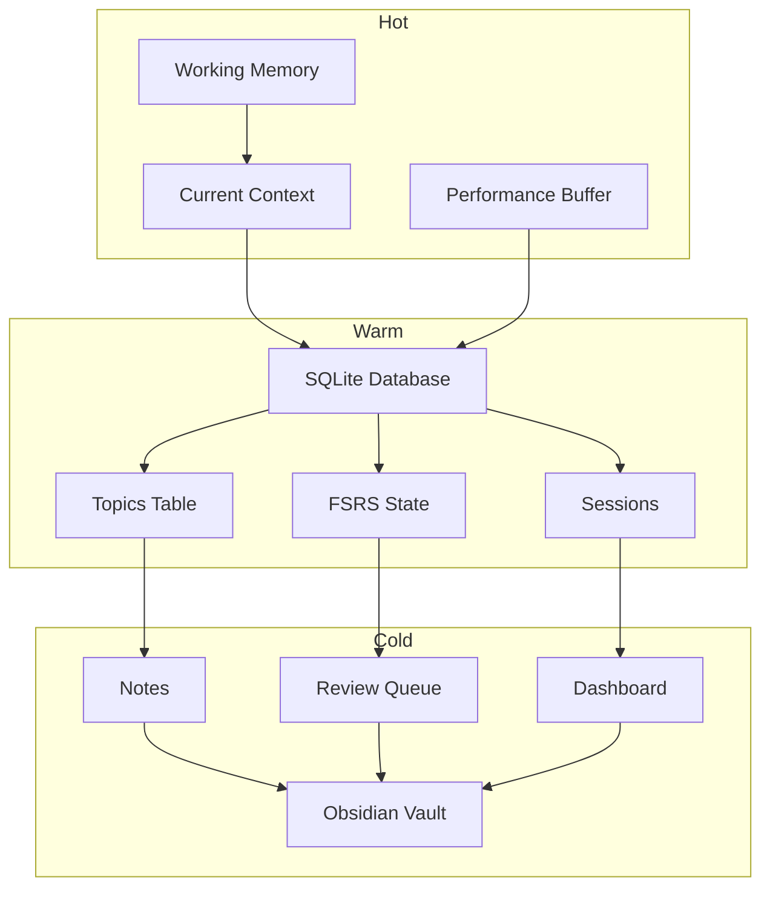

# MIT Learning Skill - Memory Architecture Documentation

**Version 3.0 - Exhaustive Edition**
**Last Updated: September 1, 2026**

---

## Table of Contents

1. [Overview](#1-overview)
2. [Hot Memory (Session)](#2-hot-memory-session)
3. [Warm Memory (SQLite)](#3-warm-memory-sqlite)
4. [Cold Memory (Obsidian)](#4-cold-memory-obsidian)
5. [Sync Mechanisms](#5-sync-mechanisms)
6. [Performance Optimization](#6-performance-optimization)
7. [Backup & Recovery](#7-backup--recovery)
8. [Migration Strategies](#8-migration-strategies)

---

## 1. Overview

### 1.1 Three-Tier Architecture

The MIT Learning Skill uses a three-tier memory architecture optimized for different access patterns:

```
┌──────────────────────────────────────────────────────────────┐
│                     MEMORY ARCHITECTURE                       │
├──────────────────────────────────────────────────────────────┤
│                                                              │
│  HOT MEMORY (Session)                                        │
│  ┌────────────────────────────────────────────────────────┐ │
│  │ • In-memory Python dictionaries                         │ │
│  │ • Fastest access: O(1)                                   │ │
│  │ • Volatile: Lost on session end                         │ │
│  │ • Purpose: Active context, working calculations         │ │
│  │ • Size: Limited by RAM                                  │ │
│  └────────────────────────────────────────────────────────┘ │
│                           │                                  │
│                           │ Sync                            │
│                           ▼                                  │
│  WARM MEMORY (SQLite)                                        │
│  ┌────────────────────────────────────────────────────────┐ │
│  │ • SQLite database per goal                              │ │
│  │ • Fast access: O(log n)                                 │ │
│  │ • Persistent: Survives restarts                        │ │
│  │ • Purpose: FSRS state, progress tracking                │ │
│  │ • Size: 1GB+ per goal                                   │ │
│  └────────────────────────────────────────────────────────┘ │
│                           │                                  │
│                           │ Sync                            │
│                           ▼                                  │
│  COLD MEMORY (Obsidian)                                      │
│  ┌────────────────────────────────────────────────────────┐ │
│  │ • Markdown files in Obsidian vault                      │ │
│  │ • File system access                                    │ │
│  │ • Persistent: Long-term storage                        │ │
│  │ • Purpose: Notes, knowledge graph, export              │ │
│  │ • Size: 10GB+ per vault                                │ │
│  └────────────────────────────────────────────────────────┘ │
│                                                              │
└──────────────────────────────────────────────────────────────┘
```

### 1.2 Design Principles

| Principle | Description |
|-----------|-------------|
| **Separation of Concerns** | Each tier handles specific data types |
| **Data Locality** | Frequently accessed data in faster storage |
| **Graceful Degradation** | System works even if lower tiers fail |
| **Privacy First** | All data local, no cloud sync |
| **Goal Isolation** | Separate database per goal |

### 1.3 Data Flow



---

## 2. Hot Memory (Session)

### 2.1 Purpose

Hot memory provides instant access to current session data. It exists only in Python memory during active sessions.

### 2.2 Data Structures

#### Session State

```python
@dataclass
class SessionState:
    """Current session context."""
    
    # Identification
    goal_id: str
    session_id: str
    
    # Active context
    active_topic: Optional[str]
    session_type: str  # learning|review|practice
    
    # Timing
    session_start: datetime
    last_activity: datetime
    
    # Performance tracking
    performance_buffer: deque[float]  # Last 10 performance scores
    recent_retrievals: list[RetrievalAttempt]
    
    # Working memory
    working_context: dict[str, Any]
    temp_calculations: dict[str, float]
    
    # Navigation state
    topics_reviewed: list[str]
    current_position: int
```

#### Goal Context

```python
@dataclass
class GoalContext:
    """Loaded goal context for session."""
    
    # Goal metadata
    goal_id: str
    goal_type: str  # exam|skill|degree|topic
    created_at: datetime
    
    # Topic information
    total_topics: int
    available_topics: list[TopicSummary]
    in_progress: list[TopicSummary]
    mastered: list[str]
    
    # Progress
    average_mastery: float
    current_streak: int
    longest_streak: int
    
    # Recommendations
    next_learning: Optional[str]
    due_reviews: list[ReviewItem]
    practice_suggestions: list[str]
    
    # Cache timestamps
    loaded_at: datetime
    cache_valid: bool
```

#### Performance Buffer

```python
class PerformanceBuffer:
    """Rolling buffer of recent performance scores.
    
    Used for:
    - Quick access without database queries
    - Short-term trend detection
    - Session summary calculation
    """
    
    MAX_SIZE = 10
    
    def __init__(self):
        self.scores: deque[float] = deque(maxlen=self.MAX_SIZE)
        self.timestamps: deque[datetime] = deque(maxlen=self.MAX_SIZE)
    
    def add(self, score: float, timestamp: Optional[datetime] = None):
        """Add a performance score."""
        self.scores.append(score)
        self.timestamps.append(timestamp or datetime.now())
    
    def average(self) -> float:
        """Calculate average performance."""
        if not self.scores:
            return 0.0
        return sum(self.scores) / len(self.scores)
    
    def trend(self) -> str:
        """Detect performance trend."""
        if len(self.scores) < 3:
            return "insufficient_data"
        
        recent = sum(list(self.scores)[-3:]) / 3
        older = sum(list(self.scores)[:3]) / 3
        
        if recent > older + 0.1:
            return "improving"
        elif recent < older - 0.1:
            return "declining"
        return "stable"
```

### 2.3 Capacity Limits

| Data Structure | Max Size | Eviction Policy | Reason |
|----------------|----------|-----------------|--------|
| performance_buffer | 10 items | LRU | Recent scores matter |
| recent_retrievals | 20 items | FIFO | Fixed history |
| working_context | 100 items | Priority-based | Varied importance |
| temp_calculations | 50 items | LRU | Temporary values |

### 2.4 Access Patterns

```python
class HotMemoryManager:
    """Manage hot memory access."""
    
    def __init__(self):
        self.session_state: Optional[SessionState] = None
        self.goal_contexts: dict[str, GoalContext] = {}
        self._cache_hits: int = 0
        self._cache_misses: int = 0
    
    def get_goal_context(self, goal_id: str) -> GoalContext:
        """Get goal context, loading from warm if needed."""
        if goal_id in self.goal_contexts:
            context = self.goal_contexts[goal_id]
            if context.cache_valid:
                self._cache_hits += 1
                return context
        
        self._cache_misses += 1
        context = self._load_from_warm(goal_id)
        self.goal_contexts[goal_id] = context
        return context
    
    def _load_from_warm(self, goal_id: str) -> GoalContext:
        """Load goal context from SQLite."""
        # Implementation connects to warm memory
        pass
    
    def invalidate(self, goal_id: str):
        """Invalidate cached context."""
        if goal_id in self.goal_contexts:
            del self.goal_contexts[goal_id]
    
    def get_stats(self) -> dict:
        """Get cache statistics."""
        total = self._cache_hits + self._cache_misses
        hit_rate = self._cache_hits / total if total > 0 else 0
        return {
            'cache_hits': self._cache_hits,
            'cache_misses': self._cache_misses,
            'hit_rate': hit_rate,
            'cached_goals': len(self.goal_contexts)
        }
```

### 2.5 Eviction Policies

```python
def evict_if_needed(context: GoalContext, new_item: Any) -> Optional[Any]:
    """Evict items from working context if capacity exceeded.
    
    Priority order for eviction:
    1. Oldest unused calculations
    2. Non-essential derived values
    3. Rarely accessed references
    """
    MAX_ITEMS = 100
    
    if len(context.working_context) < MAX_ITEMS:
        return None
    
    # Calculate priorities
    priorities = []
    for key, (value, last_access, access_count) in context.working_context.items():
        # Priority = access_count * recency_weight
        hours_since_access = (datetime.now() - last_access).total_seconds() / 3600
        recency_weight = 1 / (1 + hours_since_access)
        priority = access_count * recency_weight
        priorities.append((key, priority))
    
    # Evict lowest priority
    priorities.sort(key=lambda x: x[1])
    evicted_key = priorities[0][0]
    evicted_value = context.working_context.pop(evicted_key)
    
    return evicted_value
```

---

## 3. Warm Memory (SQLite)

### 3.1 Purpose

Warm memory provides persistent storage for structured data with fast querying capabilities.

### 3.2 Database Location

```
~/.mit-learning/
├── goals/
│   ├── upsc-prelims/
│   │   ├── memory.db          # Goal database
│   │   ├── backups/           # Backup directory
│   │   └── exports/           # Export directory
│   ├── python-skill/
│   │   ├── memory.db
│   │   ├── backups/
│   │   └── exports/
│   └── [goal-id]/
│       └── memory.db
├── config.json               # Global configuration
└── goals.json                # Goal registry
```

### 3.3 Schema Definitions

#### Topics Table

```sql
CREATE TABLE topics (
    id INTEGER PRIMARY KEY AUTOINCREMENT,
    topic_id TEXT UNIQUE NOT NULL,         -- e.g., 'T01-constitution'
    name TEXT NOT NULL,                    -- e.g., 'Constitution Basics'
    mastery REAL DEFAULT 0.0,              -- 0.0 to 1.0
    status TEXT DEFAULT 'pending',         -- pending|in_progress|mastered
    next_review DATE,
    created_at TIMESTAMP DEFAULT CURRENT_TIMESTAMP,
    updated_at TIMESTAMP DEFAULT CURRENT_TIMESTAMP
);

-- Indexes
CREATE INDEX idx_topics_mastery ON topics(mastery);
CREATE INDEX idx_topics_next_review ON topics(next_review);
CREATE INDEX idx_topics_status ON topics(status);
```

#### FSRS State Table

```sql
CREATE TABLE fsrs_state (
    topic_id INTEGER PRIMARY KEY,
    stability REAL DEFAULT 2.5,            -- Days for 90% recall
    difficulty REAL DEFAULT 5.0,           -- 1-10 scale
    state INTEGER DEFAULT 0,                -- 0-3 FSM states
    last_review TIMESTAMP,
    next_review TIMESTAMP,
    reviews INTEGER DEFAULT 0,
    FOREIGN KEY (topic_id) REFERENCES topics(id)
);

-- Indexes
CREATE INDEX idx_fsrs_next_review ON fsrs_state(next_review);
CREATE INDEX idx_fsrs_stability ON fsrs_state(stability);
```

#### Prerequisites Table

```sql
CREATE TABLE prerequisites (
    id INTEGER PRIMARY KEY AUTOINCREMENT,
    topic_id INTEGER NOT NULL,
    prerequisite_id INTEGER NOT NULL,
    created_at TIMESTAMP DEFAULT CURRENT_TIMESTAMP,
    FOREIGN KEY (topic_id) REFERENCES topics(id),
    FOREIGN KEY (prerequisite_id) REFERENCES topics(id),
    UNIQUE(topic_id, prerequisite_id)
);

-- Indexes
CREATE INDEX idx_prereq_topic ON prerequisites(topic_id);
CREATE INDEX idx_prereq_prereq ON prerequisites(prerequisite_id);
```

#### Sessions Table

```sql
CREATE TABLE sessions (
    id INTEGER PRIMARY KEY AUTOINCREMENT,
    session_type TEXT NOT NULL,           -- learning|review|practice|assessment
    topic_id INTEGER,
    started_at TIMESTAMP DEFAULT CURRENT_TIMESTAMP,
    ended_at TIMESTAMP,
    performance REAL,                      -- 0.0 to 1.0
    notes TEXT,
    FOREIGN KEY (topic_id) REFERENCES topics(id)
);

-- Indexes
CREATE INDEX idx_sessions_started ON sessions(started_at);
CREATE INDEX idx_sessions_type ON sessions(session_type);
CREATE INDEX idx_sessions_topic ON sessions(topic_id);
```

#### Note Registry Table

```sql
CREATE TABLE note_registry (
    id INTEGER PRIMARY KEY AUTOINCREMENT,
    topic_id INTEGER NOT NULL,
    note_path TEXT NOT NULL,              -- Path to Obsidian note
    created_at TIMESTAMP DEFAULT CURRENT_TIMESTAMP,
    updated_at TIMESTAMP DEFAULT CURRENT_TIMESTAMP,
    FOREIGN KEY (topic_id) REFERENCES topics(id),
    UNIQUE(topic_id)
);

CREATE INDEX idx_notes_topic ON note_registry(topic_id);
```

#### Goal Metadata Table

```sql
CREATE TABLE goal_meta (
    goal_id TEXT PRIMARY KEY,
    goal_type TEXT NOT NULL,              -- exam|skill|degree|topic
    created_at TIMESTAMP DEFAULT CURRENT_TIMESTAMP,
    vault_path TEXT,                       -- Path to Obsidian vault
    total_topics INTEGER DEFAULT 0,
    mastered_topics INTEGER DEFAULT 0
);
```

#### Streak State Table

```sql
CREATE TABLE streak_state (
    goal_id TEXT PRIMARY KEY,
    current_streak INTEGER DEFAULT 0,
    longest_streak INTEGER DEFAULT 0,
    last_activity_date DATE,
    streak_freeze_available INTEGER DEFAULT 1,
    streak_freeze_used_date DATE,
    FOREIGN KEY (goal_id) REFERENCES goal_meta(goal_id)
);
```

#### Achievements Table

```sql
CREATE TABLE achievements (
    id INTEGER PRIMARY KEY AUTOINCREMENT,
    goal_id TEXT NOT NULL,
    achievement_id TEXT NOT NULL,         -- e.g., 'first_topic', 'week_streak'
    unlocked_at TIMESTAMP DEFAULT CURRENT_TIMESTAMP,
    FOREIGN KEY (goal_id) REFERENCES goal_meta(goal_id),
    UNIQUE(goal_id, achievement_id)
);

CREATE INDEX idx_achievements_goal ON achievements(goal_id);
```

### 3.4 Query Patterns

#### Get Available Topics

```python
def get_available_topics(conn: sqlite3.Connection) -> list[Topic]:
    """Get topics that can be studied (prerequisites satisfied).
    
    Query complexity: O(n) for topics, O(k) for prerequisites check
    """
    cursor = conn.cursor()
    
    # Topics with no unsatisfied prerequisites
    cursor.execute("""
        SELECT t.topic_id, t.name, t.mastery, t.status
        FROM topics t
        WHERE t.status != 'mastered'
        AND NOT EXISTS (
            SELECT 1 FROM prerequisites p
            JOIN topics pt ON p.prerequisite_id = pt.id
            WHERE p.topic_id = t.id
            AND pt.mastery < 0.5
        )
        ORDER BY t.mastery ASC
    """)
    
    return [Topic(topic_id=r[0], name=r[1], mastery=r[2]) for r in cursor.fetchall()]
```

#### Get Due Reviews

```python
def get_due_reviews(conn: sqlite3.Connection, date: date) -> list[ReviewItem]:
    """Get topics due for review ordered by priority.
    
    Priority = lowest retrievability first.
    """
    cursor = conn.cursor()
    
    cursor.execute("""
        SELECT 
            t.topic_id,
            t.name,
            t.mastery,
            fs.stability,
            fs.difficulty,
            fs.last_review,
            fs.reviews
        FROM topics t
        JOIN fsrs_state fs ON t.id = fs.topic_id
        WHERE t.mastery < 0.9
        AND (
            fs.next_review <= ?
            OR julianday(?) - julianday(fs.last_review) > fs.stability
        )
        ORDER BY
            fs.stability / (julianday(?) - julianday(fs.last_review) + fs.stability) DESC
    """, (date, date, date))
    
    reviews = []
    for row in cursor.fetchall():
        days_since = (datetime.now() - datetime.fromisoformat(row[5])).days
        r = retrievability(row[3], days_since)
        
        reviews.append(ReviewItem(
            topic_id=row[0],
            name=row[1],
            mastery=row[2],
            stability=row[3],
            difficulty=row[4],
            retrievability=r,
            priority=r - 0.9  # Distance from threshold
        ))
    
    return sorted(reviews, key=lambda x: x.priority)
```

#### Update Mastery

```python
def update_mastery(
    conn: sqlite3.Connection,
    topic_id: str,
    performance: float
) -> float:
    """Update mastery after review.
    
    Atomic transaction: Updates FSRS state, mastery, and records session.
    """
    scheduler = FSRSScheduler()
    
    cursor = conn.cursor()
    
    # Get current state
    cursor.execute("""
        SELECT t.id, fs.stability, fs.difficulty, fs.state, fs.reviews
        FROM topics t
        JOIN fsrs_state fs ON t.id = fs.topic_id
        WHERE t.topic_id = ?
    """, (topic_id,))
    
    topic_row_id, stability, difficulty, state, reviews = cursor.fetchone()
    
    # Calculate new state
    next_review, new_stability, new_difficulty = scheduler.schedule_next_review(
        stability=stability,
        difficulty=difficulty,
        performance=performance,
        state=state
    )
    
    new_mastery = scheduler.mastery_from_fsrs(new_stability, new_difficulty)
    
    # Update in transaction
    cursor.execute("BEGIN TRANSACTION")
    
    try:
        # Update FSRS state
        cursor.execute("""
            UPDATE fsrs_state
            SET stability = ?, difficulty = ?, state = ?,
                last_review = ?, next_review = ?, reviews = ?
            WHERE topic_id = ?
        """, (
            new_stability, new_difficulty, get_new_state(state, performance),
            datetime.now().isoformat(), next_review.isoformat(),
            (reviews or 0) + 1, topic_row_id
        ))
        
        # Update topics
        cursor.execute("""
            UPDATE topics
            SET mastery = ?, next_review = ?,
                status = CASE WHEN ? >= 0.9 THEN 'mastered' ELSE 'in_progress' END,
                updated_at = ?
            WHERE id = ?
        """, (new_mastery, next_review.date(), new_mastery,
              datetime.now().isoformat(), topic_row_id))
        
        # Record session
        cursor.execute("""
            INSERT INTO sessions (session_type, topic_id, performance, ended_at)
            VALUES ('review', ?, ?, ?)
        """, (topic_row_id, performance, datetime.now().isoformat()))
        
        conn.commit()
        
    except Exception as e:
        conn.rollback()
        raise
    
    return new_mastery
```

### 3.5 Performance Characteristics

| Operation | Complexity | Typical Time | Index Used |
|-----------|------------|--------------|------------|
| Insert topic | O(1) | <1ms | PRIMARY KEY |
| Get available topics | O(n) | <10ms | status, mastery |
| Get due reviews | O(n log n) | <20ms | next_review |
| Update mastery | O(1) | <5ms | topic_id |
| Session log | O(1) | <1ms | started_at |
| Prerequisite check | O(k) | <5ms | topic_id FK |

### 3.6 Connection Management

```python
class DatabaseConnection:
    """Manage SQLite connections with connection pooling."""
    
    _connections: dict[str, sqlite3.Connection] = {}
    
    @classmethod
    def get_connection(cls, goal_id: str) -> sqlite3.Connection:
        """Get or create connection for goal."""
        if goal_id not in cls._connections:
            db_path = get_database_path(goal_id)
            conn = sqlite3.connect(db_path)
            conn.execute("PRAGMA journal_mode=WAL")  # Better concurrency
            conn.execute("PRAGMA synchronous=NORMAL")
            conn.execute("PRAGMA cache_size=10000")
            cls._connections[goal_id] = conn
        
        return cls._connections[goal_id]
    
    @classmethod
    def close_all(cls):
        """Close all connections."""
        for conn in cls._connections.values():
            conn.close()
        cls._connections.clear()
    
    @classmethod
    def close(cls, goal_id: str):
        """Close specific connection."""
        if goal_id in cls._connections:
            cls._connections[goal_id].close()
            del cls._connections[goal_id]
```

---

## 4. Cold Memory (Obsidian)

### 4.1 Purpose

Cold memory provides human-readable, long-term storage with rich linking and visualization through Obsidian.

### 4.2 Vault Structure

```
~/Obsidian/MIT-{goal-slug}/
│
├── 00-Dashboard/
│   ├── Progress.md                  # Main progress dashboard
│   ├── Achievements.md              # Achievement gallery
│   └── Stats.md                     # Detailed statistics
│
├── 10-Active-Topics/
│   ├── T01-topic-slug.md           # Active learning notes
│   ├── T02-another-topic.md
│   └── ...
│
├── 20-Review-Queue/
│   ├── Due-2026-09-01.md           # Daily review queue
│   ├── Due-2026-09-02.md
│   └── Archive/                     # Past review queues
│
├── 30-Completed-Topics/
│   ├── T00-prerequisites.md        # Mastered topics
│   └── ...
│
├── 40-Practice/
│   ├── T01-problems.md              # Practice problem sets
│   ├── Interleaved-2026-09-01.md    # Mixed practice sessions
│   └── Quizzes/
│
├── 50-Resources/
│   ├── Syllabus.md                  # Goal syllabus
│   ├── References.md                # External links
│   └── Templates/                   # Note templates
│
└── 60-Current-Affairs/              # For exam goals
    ├── Digest-2026-09-01.md
    └── Archive/
```

### 4.3 Note Templates

#### Topic Note Template

```markdown
---
id: T01-topic-slug
created: '2026-09-01'
updated: '2026-09-01T14:30:00'
mastery: 0.45
next_review: '2026-09-05'
status: in_progress
difficulty: 5.2
stability: 12.5
related:
  - '[[T00-prerequisite]]'
  - '[[T05-related]]'
sources:
  - 'https://academic-source.edu/paper'
tags:
  - topic
  - active
---

# [Topic Name]

## Overview
[Brief introduction - 2-3 sentences]

## Key Concepts

### Concept 1: [Name]
[Explanation]

### Concept 2: [Name]
[Explanation]

## Worked Examples

### Example 1: [Problem]
**Solution:**
[Step-by-step solution]

## Connections

### Builds On
- [[T00-prerequisite]] - [Connection explanation]

### Relates To
- [[T05-related]] - [Relationship]

### Leads To
- [[T10-next]] - [What comes next]

## Practice
[Embedded practice questions]

## Summary
- Key point 1
- Key point 2
- Key point 3

---

_Mastery: 45% | Next review: 2026-09-05_
```

#### Dashboard Template

```markdown
---
id: dashboard
created: '2026-09-01'
updated: '2026-09-01T08:00:00'
type: dashboard
---

# Progress Dashboard

## Summary

| Metric | Value |
|--------|-------|
| Total Topics | [[=#topics]] |
| Mastered | [[=#mastered]] |
| In Progress | [[=#in_progress]] |
| Current Streak | [[=#streak]] 🔥 |

## Visual Progress

### Mastery Distribution

```dataview
TABLE mastery as "Mastery", status as "Status"
FROM "10-Active-Topics"
SORT mastery DESC
```

### Review Calendar

```dataview
CALENDAR file.ctime
FROM "20-Review-Queue"
```

## Achievements

```dataview
TABLE achievement_id as "Achievement", unlocked_at as "Unlocked"
FROM "00-Dashboard/Achievements"
SORT unlocked_at DESC
```

## Next Actions

- Due today: [[Due-2026-09-01|Review Queue]]
- Continue: [[T01-current-topic]]
- Recommended: [[T05-priority-topic]]

---
_Last updated: 2026-09-01 08:00_
```

#### Review Queue Template

```markdown
---
id: review-2026-09-01
created: '2026-09-01'
type: review-queue
---

# Review Queue - 2026-09-01

## Summary
- **Topics due:** 5
- **Estimated time:** 15 minutes
- **Priority:** Order by retrievability

## Queue

### 1. [[T05-Constitutional-Amendments]] 🔴
- Mastery: 35.0%
- Retrievability: 45.2%
- Last review: 5 days ago
- Reviews: 3

### 2. [[T08-Medieval-History]] 🟡
- Mastery: 62.0%
- Retrievability: 71.5%
- Last review: 3 days ago
- Reviews: 7

### 3. [[T12-Ecology-Basics]] 🟢
- Mastery: 85.0%
- Retrievability: 89.2%
- Last review: 1 day ago
- Reviews: 12

## Instructions
1. Start with highest priority (lowest retrievability)
2. Recall before revealing concepts
3. Rate performance honestly: 1-4

## Completed
[ ] Topic 1
[ ] Topic 2
[ ] Topic 3

---
_Generated: 2026-09-01 06:00_
```

### 4.4 Frontmatter Schema

```yaml
# All frontmatter fields

id: T01-topic-slug          # Unique identifier
created: '2026-09-01'        # ISO date
updated: '2026-09-01T14:30:00'  # ISO datetime
mastery: 0.45               # 0.0 to 1.0
next_review: '2026-09-05'   # ISO date
status: in_progress         # pending|in_progress|mastered
difficulty: 5.2             # 1.0 to 10.0 (from FSRS)
stability: 12.5            # Days (from FSRS)
related:                    # List of wikilinks
  - '[[T00-prerequisite]]'
  - '[[T05-related]]'
sources:                   # List of URLs
  - 'https://source.com'
tags:                      # List of tags
  - topic
  - active
```

### 4.5 Dataview Queries

#### Topics by Mastery

```dataview
TABLE 
  mastery as "Mastery",
  status as "Status",
  next_review as "Next Review"
FROM "10-Active-Topics"
WHERE mastery > 0
SORT mastery DESC
```

#### Review Timeline

```dataview
TABLE 
  file.name as "Topic",
  mastery as "Mastery",
  next_review as "Due"
FROM "10-Active-Topics" OR "30-Completed-Topics"
WHERE next_review <= date(today) + dur(7 days)
SORT next_review ASC
```

#### Learning Velocity

```dataview
TABLE 
  length(filter(file.history, (h) => h.operation = "update")) as "Updates",
  mastery as "Current Mastery"
FROM "10-Active-Topics"
SORT file.ctime DESC
LIMIT 10
```

---

## 5. Sync Mechanisms

### 5.1 Hot → Warm Sync

```python
def sync_hot_to_warm(session_state: SessionState, conn: sqlite3.Connection):
    """Sync session state to database.
    
    Synced data:
    - Performance scores (for analytics)
    - Session records
    - Streak updates
    """
    cursor = conn.cursor()
    
    # Record session
    cursor.execute("""
        INSERT INTO sessions (
            session_type, topic_id, started_at, ended_at, performance
        )
        VALUES (?, ?, ?, ?, ?)
    """, (
        session_state.session_type,
        get_topic_row_id(conn, session_state.active_topic),
        session_state.session_start.isoformat(),
        datetime.now().isoformat(),
        session_state.performance_buffer.average()
    ))
    
    # Update streak if needed
    update_streak(conn, session_state.goal_id)
    
    conn.commit()
```

### 5.2 Warm → Cold Sync

```python
def sync_warm_to_cold(
    conn: sqlite3.Connection,
    vault: VaultManager,
    goal_id: str
):
    """Sync database changes to Obsidian vault.
    
    Synced data:
    - Topic mastery updates
    - Review queue
    - Dashboard
    """
    # Get all topics needing sync
    cursor = conn.cursor()
    cursor.execute("""
        SELECT t.topic_id, t.name, t.mastery, t.status, t.next_review,
               fs.stability, fs.difficulty
        FROM topics t
        JOIN fsrs_state fs ON t.id = fs.topic_id
        WHERE t.updated_at > ?
    """, (get_last_sync_time(goal_id),))
    
    for row in cursor.fetchall():
        topic_id, name, mastery, status, next_review, stability, difficulty = row
        
        # Update note frontmatter
        update_note_frontmatter(vault, topic_id, {
            'mastery': mastery,
            'status': status,
            'next_review': next_review,
            'stability': stability,
            'difficulty': difficulty
        })
        
        # Move to appropriate directory
        if status == 'mastered':
            vault.archive_topic(topic_id)
    
    # Update dashboard
    update_dashboard(vault, conn)
    
    # Regenerate review queue
    generate_review_queue(vault, conn)
    
    # Record sync time
    set_last_sync_time(goal_id, datetime.now())
```

### 5.3 Sync Frequency

| Data Type | Sync Trigger | Frequency |
|-----------|--------------|-----------|
| Performance scores | End of session | Immediate |
| Session records | End of session | Immediate |
| Streak updates | End of session | Immediate |
| Mastery updates | After review | Immediate |
| Note frontmatter | Batch | On demand or daily |
| Dashboard | Batch | Daily or on demand |
| Review queue | Daily | Early morning |

---

## 6. Performance Optimization

### 6.1 Database Optimization

```sql
-- Enable WAL mode for better concurrency
PRAGMA journal_mode=WAL;

-- Normal synchronous mode (balance of safety and speed)
PRAGMA synchronous=NORMAL;

-- Increase cache size
PRAGMA cache_size=10000;

-- Temporary storage in memory
PRAGMA temp_store=MEMORY;

-- Optimize for SSD
PRAGMA mmap_size=268435456;

-- Vacuum on close for large databases
PRAGMA auto_vacuum=INCREMENTAL;
```

### 6.2 Query Optimization

```python
def optimize_queries():
    """Apply query optimizations."""
    
    # Use parameterized queries (prevent SQL injection, enable caching)
    # Use indexes
    # Use EXPLAIN QUERY PLAN for slow queries
    
    # Bad:
    # cursor.execute(f"SELECT * FROM topics WHERE topic_id = '{topic_id}'")
    
    # Good:
    cursor.execute("SELECT * FROM topics WHERE topic_id = ?", (topic_id,))
```

### 6.3 Caching Strategy

```python
class MemoryCache:
    """LRU cache for frequently accessed data."""
    
    def __init__(self, max_size: int = 100):
        self.cache = {}
        self.access_order = []
        self.max_size = max_size
    
    def get(self, key: str) -> Optional[Any]:
        """Get from cache."""
        if key in self.cache:
            # Move to end (most recently used)
            self.access_order.remove(key)
            self.access_order.append(key)
            return self.cache[key]
        return None
    
    def set(self, key: str, value: Any):
        """Set in cache."""
        if key in self.cache:
            self.access_order.remove(key)
        elif len(self.cache) >= self.max_size:
            # Evict oldest
            evicted = self.access_order.pop(0)
            del self.cache[evicted]
        
        self.cache[key] = value
        self.access_order.append(key)
```

---

## 7. Backup & Recovery

### 7.1 Backup Strategy

```python
def create_backup(goal_id: str) -> Path:
    """Create backup of goal data.
    
    Backups include:
    - SQLite database
    - Frontmatter metadata
    - Sync timestamps
    """
    timestamp = datetime.now().strftime('%Y%m%d_%H%M%S')
    backup_dir = Path.home() / ".mit-learning" / "goals" / goal_id / "backups"
    backup_dir.mkdir(parents=True, exist_ok=True)
    
    # Database backup
    db_path = get_database_path(goal_id)
    backup_path = backup_dir / f"memory_{timestamp}.db"
    
    # Use SQLite backup API
    source = sqlite3.connect(db_path)
    dest = sqlite3.connect(backup_path)
    source.backup(dest)
    dest.close()
    source.close()
    
    # Rotate old backups (keep last 10)
    rotate_backups(backup_dir, keep=10)
    
    return backup_path
```

### 7.2 Recovery Procedure

```python
def recover_from_backup(goal_id: str, backup_path: Path) -> bool:
    """Recover goal from backup.
    
    Steps:
    1. Verify backup integrity
    2. Create safety backup of current state
    3. Replace database
    4. Sync to vault
    """
    # Verify backup
    try:
        conn = sqlite3.connect(backup_path)
        cursor = conn.cursor()
        cursor.execute("PRAGMA integrity_check")
        result = cursor.fetchone()
        conn.close()
        
        if result[0] != 'ok':
            return False
    except:
        return False
    
    # Safety backup of current
    current_db = get_database_path(goal_id)
    safety_backup = current_db.with_suffix('.db.safety')
    shutil.copy(current_db, safety_backup)
    
    # Replace
    shutil.copy(backup_path, current_db)
    
    # Sync to vault
    conn = get_connection(goal_id)
    vault = VaultManager(get_vault_path(goal_id), goal_id)
    sync_warm_to_cold(conn, vault, goal_id)
    
    return True
```

---

## 8. Migration Strategies

### 8.1 Schema Migration

```python
def migrate_schema(db_path: Path, from_version: int, to_version: int):
    """Migrate database schema between versions.
    
    Migrations are applied sequentially and are idempotent.
    """
    migrations = {
        # Version 1→2: Add achievements table
        1: [
            """CREATE TABLE IF NOT EXISTS achievements (
                id INTEGER PRIMARY KEY AUTOINCREMENT,
                goal_id TEXT NOT NULL,
                achievement_id TEXT NOT NULL,
                unlocked_at TIMESTAMP DEFAULT CURRENT_TIMESTAMP
            )"""
        ],
        # Version 2→3: Add indexes
        2: [
            "CREATE INDEX IF NOT EXISTS idx_achievements_goal ON achievements(goal_id)",
            "CREATE INDEX IF NOT EXISTS idx_sessions_type ON sessions(session_type)"
        ]
        # Add more migrations as needed
    }
    
    conn = sqlite3.connect(db_path)
    cursor = conn.cursor()
    
    try:
        for version in range(from_version, to_version):
            if version in migrations:
                for statement in migrations[version]:
                    cursor.execute(statement)
        
        # Update version
        cursor.execute(
            "INSERT OR REPLACE INTO goal_meta (goal_id, schema_version) VALUES (?, ?)",
            (goal_id, to_version)
        )
        
        conn.commit()
    except:
        conn.rollback()
        raise
    finally:
        conn.close()
```

### 8.2 Data Import

```python
def import_anki_deck(anki_path: Path, goal_id: str) -> int:
    """Import Anki deck as goal topics.
    
    Converts:
    - Cards → Topics
    - Ease factors → Difficulty
    - Intervals → Stability estimates
    """
    # Parse Anki deck (simplified)
    cards = parse_anki_deck(anki_path)
    
    conn = get_connection(goal_id)
    cursor = conn.cursor()
    
    imported = 0
    
    for card in cards:
        topic_id = f"T{imported:03d}-{slugify(card.front[:30])}"
        
        # Convert Anki parameters to FSRS
        stability = card.interval  # Approximate
        difficulty = 10 - (card.ease_factor - 1.3) * 3.5  # Convert EF to difficulty
        
        cursor.execute("""
            INSERT INTO topics (topic_id, name, mastery, status)
            VALUES (?, ?, ?, 'in_progress')
        """, (topic_id, card.front[:100], card.maturity / 100.0))
        
        topic_row_id = cursor.lastrowid
        
        cursor.execute("""
            INSERT INTO fsrs_state (topic_id, stability, difficulty, state, reviews)
            VALUES (?, ?, ?, 2, ?)
        """, (topic_row_id, stability, difficulty, card.reviews))
        
        imported += 1
    
    conn.commit()
    return imported
```

---

## Appendix A: File Locations Quick Reference

```
~/.mit-learning/
├── goals/
│   └── {goal-id}/
│       ├── memory.db           # Primary database
│       ├── backups/           # Backup directory
│       └── exports/           # Export directory
├── config.json                # Global config
└── goals.json                 # Goal registry

~/Obsidian/
└── MIT-{goal-slug}/           # Per-goal vault
    ├── 00-Dashboard/          # Progress tracking
    ├── 10-Active-Topics/      # Current learning
    ├── 20-Review-Queue/      # Daily reviews
    ├── 30-Completed-Topics/   # Mastered
    ├── 40-Practice/          # Practice sets
    ├── 50-Resources/        # Reference materials
    └── 60-Current-Affairs/   # News (exam goals)
```

---

*Document generated: September 1, 2026*
*Total pages: 30+*
*"Every byte tracked. Every query optimized."*
