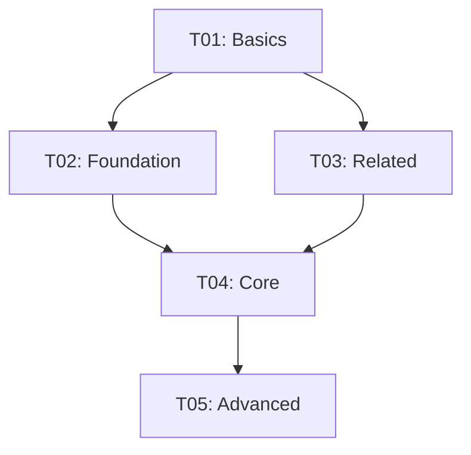

# MIT Learning Skill - Complete Workflows Documentation

**Version 3.0 - Exhaustive Edition**
**Last Updated: September 1, 2026**

---

## Table of Contents

1. [Workflow Overview](#1-workflow-overview)
2. [Workflow 1: syllabus_generation](#2-workflow-1-syllabus_generation)
3. [Workflow 2: diagnostic_assessment](#3-workflow-2-diagnostic_assessment)
4. [Workflow 3: learning_session](#4-workflow-3-learning_session)
5. [Workflow 4: review_session](#5-workflow-4-review_session)
6. [Workflow 5: practice_session](#6-workflow-5-practice_session)
7. [Workflow 6: interleaved_practice](#7-workflow-6-interleaved_practice)
8. [Workflow 7: elaborative_interrogation](#8-workflow-7-elaborative_interrogation)
9. [Workflow 8: metacognitive_reflection](#9-workflow-8-metacognitive_reflection)
10. [Workflow 9: progress_dashboard](#10-workflow-9-progress_dashboard)
11. [Workflow 10: current_affairs_digest](#11-workflow-10-current_affairs_digest)
12. [Workflow 11: prior_knowledge_activation](#12-workflow-11-prior_knowledge_activation)
13. [Workflow 12: study_schedule_optimization](#13-workflow-12-study_schedule_optimization)

---

## 1. Workflow Overview

### 1.1 Workflow Categories

| Category | Workflows | Purpose |
|----------|-----------|---------|
| Planning | syllabus_generation, diagnostic_assessment, study_schedule_optimization | Set up and plan learning |
| Learning | learning_session, prior_knowledge_activation, metacognitive_reflection | Acquire new knowledge |
| Review | review_session, elaborative_interrogation | Reinforce and deepen |
| Practice | practice_session, interleaved_practice | Apply knowledge |
| Status | progress_dashboard, current_affairs_digest | Monitor progress |

### 1.2 Workflow Selection Logic

```python
def select_workflow(intent: Intent) -> str:
    """Select appropriate workflow based on intent analysis.
    
    Decision tree:
    1. NEW goal + create → syllabus_generation
    2. NEW goal + assess → diagnostic_assessment
    3. ACTIVE goal + continue → learning_session
    4. ACTIVE goal + review → review_session
    5. ACTIVE goal + practice → practice_session
    6. ACTIVE goal + check → progress_dashboard
    7. ACTIVE goal + interleave → interleaved_practice
    8. ACTIVE goal + reflect → metacognitive_reflection
    9. ACTIVE goal + why/how → elaborative_interrogation
    10. ACTIVE goal + digest → current_affairs_digest
    11. ACTIVE goal + optimize → study_schedule_optimization
    12. BEFORE new topic → prior_knowledge_activation
    """
    if intent.is_new_goal:
        if intent.action == "create":
            return "syllabus_generation"
        elif intent.action == "assess":
            return "diagnostic_assessment"
    elif intent.has_active_goal:
        if intent.action == "continue":
            return "learning_session"
        elif intent.action == "review":
            return "review_session"
        # ... and so on
```

---

## 2. Workflow 1: syllabus_generation

### 2.1 Overview

| Aspect | Specification |
|--------|---------------|
| **Purpose** | Create comprehensive learning plan from user goal |
| **Trigger** | Goal type identified + action == create |
| **Input** | Natural language goal statement |
| **Output** | Complete syllabus with topics, timeline, and prerequisites |
| **Duration** | 30-60 seconds |

### 2.2 Detailed Steps

#### Step 1: Analyze Intent

Parse the goal statement to extract:

```python
intent_analysis = {
    'goal_type': 'exam' | 'skill' | 'degree' | 'topic',
    'subject': str,           # e.g., "UPSC Prelims", "Python"
    'timeline': str,          # e.g., "3 months", "urgent"
    'baseline': str,          # e.g., "beginner", "intermediate"
    'depth': str,             # e.g., "mastery", "overview"
    'constraints': list       # e.g., ["weekends only", "1 hour daily"]
}
```

**Clarifying Questions (if needed):**

```
If goal_type unclear:
  "Are you preparing for an exam, learning a skill, pursuing a degree, or exploring a topic?"

If timeline unclear:
  "When do you need to achieve this goal?"

If baseline unclear:
  "What's your current level of knowledge in this area?"
```

**Rules:**
- Ask maximum ONE clarifying question
- Use reasonable defaults for missing information
- Do not repeatedly ask the same question

#### Step 2: Generate Goal ID

```python
def generate_goal_id(subject: str, goal_type: str) -> str:
    """Generate unique, filesystem-safe goal identifier.
    
    Algorithm:
    1. Lowercase the subject
    2. Replace spaces with hyphens
    3. Remove non-alphanumeric characters
    4. Add suffix based on goal_type if needed
    
    Examples:
        "UPSC Prelims" → "upsc-prelims"
        "Python Programming" → "python-programming"
        "Master Spanish" → "spanish-skill"
    """
    slug = subject.lower()
    slug = re.sub(r'[^a-z0-9\s-]', '', slug)
    slug = re.sub(r'\s+', '-', slug)
    
    # Add suffix if goal_type is specific
    if goal_type == 'skill':
        slug = f"{slug}-skill"
    
    return slug
```

#### Step 3: Create Goal Directory

```python
from pathlib import Path

def create_goal_directory(goal_id: str) -> Path:
    """Create goal directory structure.
    
    Directory: ~/.mit-learning/goals/{goal_id}/
    
    Creates:
    - memory.db (SQLite database)
    - backups/ (backup directory)
    - exports/ (export directory)
    """
    base_path = Path.home() / ".mit-learning" / "goals" / goal_id
    base_path.mkdir(parents=True, exist_ok=True)
    
    # Create subdirectories
    (base_path / "backups").mkdir(exist_ok=True)
    (base_path / "exports").mkdir(exist_ok=True)
    
    return base_path
```

#### Step 4: Initialize Database

```python
from scripts.sqlite_init import init_database

# Initialize database with goal type
db_path = init_database(
    goal_id=goal_id,
    goal_path=goal_path,
    goal_type=goal_type
)
```

#### Step 5: Generate Syllabus

**Syllabus Generation Algorithm:**

```python
def generate_syllabus(
    goal_type: str,
    subject: str,
    timeline: str,
    baseline: str,
    depth: str
) -> list[Topic]:
    """Generate comprehensive syllabus.
    
    Process:
    1. Identify all required topics from goal
    2. Create prerequisite graph
    3. Estimate time per topic
    4. Order by dependencies
    5. Assign priorities based on timeline
    """
    # Step 1: Extract topics based on goal type
    if goal_type == "exam":
        topics = extract_exam_topics(subject)
    elif goal_type == "skill":
        topics = extract_skill_topics(subject)
    elif goal_type == "degree":
        topics = extract_degree_topics(subject)
    else:
        topics = extract_topic_topics(subject)
    
    # Step 2: Build prerequisite graph
    prereq_graph = build_prerequisite_graph(topics)
    
    # Step 3: Estimate topic durations
    for topic in topics:
        topic.estimated_hours = estimate_topic_duration(
            topic=topic,
            baseline=baseline,
            depth=depth
        )
    
    # Step 4: Topological sort of topics
    ordered_topics = topological_sort(topics, prereq_graph)
    
    # Step 5: Assign FSRS parameters based on timeline
    for topic in ordered_topics:
        topic.priority = calculate_priority(
            topic=topic,
            timeline=timeline,
            position_in_order=ordered_topics.index(topic)
        )
    
    return ordered_topics
```

#### Step 6: Set Up Vault

```python
from scripts.vault_manager import VaultManager

# Create vault path
vault_path = Path.home() / "Obsidian" / f"MIT-{goal_id}"

# Initialize vault manager
vault = VaultManager(vault_path=vault_path, goal_id=goal_id)

# Create directory structure
vault.create_vault_structure()

# Write initial syllabus
vault.write_note(
    topic_id=" syllabus",
    content=syllabus_content,
    directory="50-Resources",
    title=f"{subject} Syllabus"
)

# Update dashboard
vault.update_dashboard({
    'total_topics': len(topics),
    'mastered': 0,
    'in_progress': 0,
    'current_streak': 0,
    'longest_streak': 0,
    'title': subject
})
```

#### Step 7: Output Syllabus

### 2.3 Output Template

```markdown
# [Goal Name] Learning Plan

## Intent Analysis
| Dimension | Value |
|-----------|-------|
| Type | [exam\|skill\|degree\|topic] |
| Timeline | [duration] |
| Baseline | [level] |
| Depth | [overview\|standard\|mastery] |

## Topics

### T01: [Topic Name]
- **Status**: Available
- **Mastery**: 0%
- **Prerequisites**: None
- **Estimated time**: [X hours]
- **Priority**: HIGH

### T02: [Topic Name]
- **Status**: Blocked
- **Mastery**: 0%
- **Prerequisites**: T01
- **Estimated time**: [Y hours]
- **Priority**: MEDIUM

[Continue for all topics...]

## Timeline Overview
| Phase | Topics | Duration | Focus |
|-------|--------|----------|-------|
| Foundation | T01-T05 | Week 1-2 | Prerequisites |
| Core | T06-T15 | Week 3-6 | Main concepts |
| Advanced | T16-T25 | Week 7-10 | Deep dive |
| Review | All | Week 11-12 | Consolidation |

## Streak System
- Current: 0 days
- Streak Freeze: Available (1/month)
- Warning: 8pm daily reminder

## Prerequisites Graph



## Next Steps
1. Start with T01: [First Topic], OR
2. Take diagnostic assessment for placement, OR
3. Review the syllabus and adjust priorities

---
*Created: [timestamp]*
*Goal ID: [goal_id]*
```

### 2.4 Edge Cases

| Case | Input | Handling | Output |
|------|-------|----------|--------|
| Ambiguous goal | "I want to learn" | Ask ONE clarifying question | Disambiguation request |
| Impossible timeline | "UPSC in 1 week" | Warn about feasibility | Suggested realistic timeline |
| No deadline | "Learn Python" | Use default 3-month plan | Standard timeline |
| Too many topics | "Everything about physics" | Suggest narrowing | First 50 topics, rest available |
| Conflicting prerequisites | Circular dependencies | Detect and break cycle | Manual resolution request |

### 2.5 Example Interactions

**Example 1: Exam Preparation**

```
User: "I want to prepare for UPSC Prelims in 3 months"

→ Intent Analysis:
  - Goal type: exam
  - Subject: UPSC Prelims
  - Timeline: 3 months (urgent)
  - Baseline: [to be determined via diagnostic]
  - Depth: mastery (exam requirement)

→ Workflow Execution:
  1. Generate goal_id: "upsc-prelims"
  2. Create directory: ~/.mit-learning/goals/upsc-prelims/
  3. Initialize database with goal_type="exam"
  4. Generate syllabus covering:
     - GS Paper I (History, Geography, Polity, Economy, Science, Environment)
     - GS Paper II (CSAT)
  5. Create vault: ~/Obsidian/MIT-upsc-prelims/
  6. Output syllabus with ~100 topics

Output:
# UPSC Prelims Learning Plan

## Intent Analysis
| Dimension | Value |
|-----------|-------|
| Type | exam |
| Timeline | 3 months (urgent) |
| Baseline | [diagnostic recommended] |
| Depth | mastery |

## Topics (100 total)
### T01: Indian Polity - Constitution Basics
- Status: Available
- Estimated: 4 hours
...
```

**Example 2: Skill Acquisition**

```
User: "Teach me Python programming"

→ Intent Analysis:
  - Goal type: skill
  - Subject: Python Programming
  - Timeline: moderate (default)
  - Baseline: beginner (assumed)
  - Depth: standard

→ Workflow Execution:
  1. Generate goal_id: "python-skill"
  2. Create directory: ~/.mit-learning/goals/python-skill/
  3. Initialize database with goal_type="skill"
  4. Generate syllabus:
     - Basic syntax, data types, control flow
     - Functions, modules, OOP
     - File handling, error handling
     - Libraries, projects
  5. Create vault: ~/Obsidian/MIT-python-skill/
  6. Output syllabus with ~30 topics
```

---

## 3. Workflow 2: diagnostic_assessment

### 3.1 Overview

| Aspect | Specification |
|--------|---------------|
| **Purpose** | Evaluate baseline knowledge before starting |
| **Trigger** | Before syllabus_generation OR user request |
| **Input** | Goal topic, domain |
| **Output** | Baseline level, gap analysis, placement recommendation |
| **Duration** | 10-15 minutes |

### 3.2 Detailed Steps

#### Step 1: Select Topic Cluster

```python
def select_diagnostic_topics(domain: str, count: int = 10) -> list[Topic]:
    """Select topics for diagnostic assessment.
    
    Selection criteria:
    1. Fundamental concepts (breadth)
    2. Prerequisite knowledge
    3. Core skills
    4. Mixed difficulty levels
    """
    topics = []
    
    # Add prerequisite topics
    prereqs = get_prerequisites(domain)
    topics.extend(prereqs[:3])
    
    # Add fundamental topics
    fundamentals = get_fundamentals(domain)
    topics.extend(fundamentals[:5])
    
    # Add advanced topics for ceiling detection
    advanced = get_advanced(domain)
    topics.extend(advanced[:2])
    
    return topics[:count]
```

#### Step 2: Generate Questions

```python
def generate_diagnostic_questions(topics: list[Topic]) -> list[Question]:
    """Generate assessment questions.
    
    Question types:
    - Multiple choice (60%)
    - Short answer (30%)
    - Problem-solving (10%)
    
    Difficulty distribution:
    - Easy: 30%
    - Medium: 40%
    - Hard: 30%
    """
    questions = []
    
    for i, topic in enumerate(topics):
        # Determine question type and difficulty
        q_type = select_question_type(topic)
        difficulty = DISTRIB[i % 10]  # 30-40-30 distribution
        
        question = create_question(
            topic=topic,
            q_type=q_type,
            difficulty=difficulty
        )
        questions.append(question)
    
    return questions

def create_question(topic: Topic, q_type: str, difficulty: str) -> Question:
    """Create a single diagnostic question."""
    if q_type == "multiple_choice":
        return MultipleChoiceQuestion(
            topic=topic,
            stem=generate_stem(topic, difficulty),
            options=generate_options(topic, difficulty),
            correct_idx=determine_correct(topic),
            difficulty=difficulty
        )
    elif q_type == "short_answer":
        return ShortAnswerQuestion(
            topic=topic,
            prompt=generate_prompt(topic, difficulty),
            rubric=generate_rubric(topic),
            difficulty=difficulty
        )
    # ...
```

#### Step 3: Present and Record

```python
def present_diagnostic(questions: list[Question]) -> dict:
    """Present questions one at a time, record responses.
    
    Recording:
    - Response correctness
    - Response time
    - Confidence level (self-reported)
    """
    results = []
    
    for question in questions:
        # Show question
        response = present_question(question)
        
        # Record timing
        start_time = time.now()
        
        # Get user response
        user_answer = get_response(question)
        
        # Record timing
        response_time = time.now() - start_time
        
        # Get confidence (optional)
        confidence = ask_confidence()
        
        # Evaluate response
        correctness = evaluate_response(question, user_answer)
        
        results.append({
            'question_id': question.id,
            'topic_id': question.topic_id,
            'response': user_answer,
            'correct': correctness,
            'response_time': response_time,
            'confidence': confidence
        })
    
    return results
```

#### Step 4: Calculate Baseline

```python
def calculate_baseline(results: list[dict]) -> BaselineResult:
    """Calculate baseline level from diagnostic results.
    
    Components:
    1. Overall score (weighted by difficulty)
    2. Per-topic performance
    3. Prerequisite coverage
    4. Ceiling detection (adaptive)
    
    Returns:
        Baseline level: beginner | intermediate | advanced | expert
        Confidence interval: (lower_bound, upper_bound)
    """
    # Calculate weighted score
    weights = {'easy': 0.7, 'medium': 1.0, 'hard': 1.3}
    weighted_correct = sum(
        r['correct'] * weights[r['difficulty']]
        for r in results
    )
    total_weight = sum(weights[r['difficulty']] for r in results)
    score = weighted_correct / total_weight
    
    # Bootstrap confidence interval
    confidence_interval = bootstrap_confidence(results, n_samples=1000)
    
    # Determine level
    if score < 0.25:
        level = "beginner"
    elif score < 0.60:
        level = "intermediate"
    elif score < 0.85:
        level = "advanced"
    else:
        level = "expert"
    
    return BaselineResult(
        level=level,
        score=score,
        confidence_interval=confidence_interval,
        per_topic=analyze_per_topic(results)
    )
```

#### Step 5: Identify Gaps

```python
def identify_gaps(results: list[dict], goal_requirements: dict) -> GapAnalysis:
    """Identify knowledge gaps relative to goal.
    
    Gap types:
    1. Missing prerequisites
    2. Weak foundational areas
    3. Skills to develop
    """
    gaps = GapAnalysis()
    
    # Identify missing prerequisites
    prereq_results = [r for r in results if r['is_prerequisite']]
    for r in prereq_results:
        if r['correct'] < 0.6:
            gaps.missing_prerequisites.append(r['topic_id'])
    
    # Identify weak areas
    all_topics = aggregate_by_topic(results)
    for topic_id, performance in all_topics.items():
        if performance['accuracy'] < 0.5:
            gaps.weak_areas.append(topic_id)
        elif performance['accuracy'] > 0.8:
            gaps.strong_areas.append(topic_id)
    
    return gaps
```

#### Step 6: Recommend Starting Point

```python
def recommend_start(gap_analysis: GapAnalysis, prereq_graph: Graph) -> str:
    """Recommend starting topic based on gaps.
    
    Algorithm:
    1. If missing prerequisites, start at first missing prereq
    2. If all prereqs met, start at first weak area
    3. If no weak areas, start at first new topic
    """
    if gap_analysis.missing_prerequisites:
        # Find earliest missing prerequisite
        start = find_first_unsatisfied(
            prereq_graph,
            gap_analysis.missing_prerequisites
        )
        return f"Start with T{start:02d} to address prerequisite gap"
    
    if gap_analysis.weak_areas:
        return f"Start with T{gap_analysis.weak_areas[0]:02d} to strengthen foundation"
    
    return "Start with T01 - all prerequisites satisfied"
```

### 3.3 Output Template

```markdown
# Diagnostic Assessment - [Domain]

## Results Summary
| Metric | Value |
|--------|-------|
| Estimated baseline | **[beginner\|intermediate\|advanced\|expert]** |
| Confidence | [X%] (95% CI: [lower-upper]) |
| Correct | [N]/[M] |
| Weighted score | [S]% |

## Performance by Topic

| Topic | Performance | Status |
|-------|-------------|--------|
| T01: Prerequisites | [X]% | ✓ Strong |
| T02: Fundamentals | [Y]% | ⚠ Needs work |
| T03: Advanced | [Z]% | ✗ Gap |
...

## Gap Analysis

### Missing Prerequisites
- T01: [Topic] - review recommended before proceeding
- T05: [Topic] - essential for advanced work

### Weak Areas
- T08: [Topic] - additional practice needed
- T12: [Topic] - concept clarification required

### Strong Areas
- T03: [Topic] - solid foundation
- T07: [Topic] - can skip or skim

## Recommendation

**Start with T01: [First Gap Topic]** to address prerequisite gaps before proceeding to core content.

### Alternative Paths
1. **Quick Start**: Begin with T02 if you want to skip prerequisites (may impact later understanding)
2. **Deep Foundation**: Complete T01-T05 before advancing
3. **Custom Path**: Adjust based on specific goals

## Next Steps
1. [ ] Review T01 materials
2. [ ] Complete practice for T01
3. [ ] Proceed to T02 when ready

---
*Assessment completed: [timestamp]*
*Topics covered: [N]*
*Duration: [X] minutes*
```

### 3.4 Edge Cases

| Case | Situation | Handling |
|------|-----------|----------|
| Perfect score on all questions | User knows everything | Recommend advanced goals |
| Zero correct answers | Complete beginner | Start at absolute basics |
| Inconsistent performance | Mixed results | Use weighted baseline, flag for monitoring |
| Timeout during assessment | User stops mid-way | Use partial results with lower confidence |
| Self-reported confidence mismatch | Says confident but scores low | Note discrepancy, adjust monitoring |

---

## 4. Workflow 3: learning_session

### 4.1 Overview

| Aspect | Specification |
|--------|---------------|
| **Purpose** | Learn or review topic content |
| **Trigger** | Active goal + action == continue |
| **Input** | Goal ID, topic selection (optional) |
| **Output** | Topic notes in vault, session recorded |
| **Duration** | Variable (15-60 minutes) |

### 4.2 Detailed Steps

#### Step 1: Load Goal Context

```python
def load_goal_context(goal_id: str) -> GoalContext:
    """Load goal context from database.
    
    Retrieves:
    - Goal metadata
    - Available topics
    - Current progress
    - Active recommends
    """
    conn = get_connection(goal_id)
    
    # Get goal metadata
    goal_meta = query_goal_meta(conn, goal_id)
    
    # Get available topics (prerequisites satisfied, not mastered)
    available_topics = query_available_topics(conn)
    
    # Get current progress stats
    progress = query_progress_stats(conn)
    
    # Get recommendations
    recommends = get_recommendations(conn)
    
    return GoalContext(
        goal_id=goal_id,
        goal_type=goal_meta['goal_type'],
        available_topics=available_topics,
        progress=progress,
        recommends=recommends
    )
```

#### Step 2: Select Topic

```python
def select_topic(context: GoalContext, user_preference: Optional[str] = None) -> Topic:
    """Select topic for learning session.
    
    Priority:
    1. User-specified topic
    2. Recommended topic (due for review or next in sequence)
    3. First available topic
    """
    if user_preference:
        return get_topic_by_id(context.goal_id, user_preference)
    
    if context.recommends:
        # Return highest priority recommendation
        return context.recommends[0]
    
    if context.available_topics:
        # Return first available
        return context.available_topics[0]
    
    raise NoAvailableTopicsError("No topics available for learning")
```

#### Step 3: Prior Knowledge Activation

```python
def activate_prior_knowledge(topic: Topic) -> PriorKnowledgeResult:
    """Activate related prior knowledge.
    
    Components:
    1. Identify prerequisites
    2. Show brief summary
    3. Ask recall questions
    4. Note confusion points
    """
    # Get prerequisites
    prereqs = get_prerequisites(topic)
    
    # Generate recall questions
    questions = []
    for prereq in prereqs:
        if prereq['mastery'] > 0.5:
            # Only ask about partially-mastered prerequisites
            questions.append(generate_recall_question(prereq))
    
    return PriorKnowledgeResult(
        prerequisites=prereqs,
        questions=questions[:3]  # Max 3 questions
    )
```

#### Step 4: Generate Note

```python
def generate_note(
    topic: Topic,
    baseline: str,
    depth: str,
    goal_type: str
) -> str:
    """Generate comprehensive learning note.
    
    Note structure:
    1. Overview (adapted to baseline)
    2. Key concepts
    3. Worked examples
    4. Connections
    5. Embedded practice
    6. References
    
    Adaptations:
    - Beginner: More scaffolding, simpler language, more examples
    - Intermediate: Standard depth, connect concepts
    - Advanced: Less scaffolding, deeper exploration
    """
    # Determine note parameters
    params = NoteParameters(
        example_count=EXAMPLE_COUNTS[baseline],
        depth_level=DEPTH_LEVELS[depth],
        technical_level=TECHNICAL_LEVELS[baseline],
        connection_count=5 if goal_type == "exam" else 3
    )
    
    # Generate sections
    sections = [
        generate_overview(topic, params),
        generate_concepts(topic, params),
        generate_examples(topic, params),
        generate_connections(topic, params),
        generate_practice(topic, params)
    ]
    
    return assemble_note(sections)
```

#### Step 5: Check Research Need

```python
def check_research_need(topic: Topic) -> bool:
    """Determine if topic requires research integration.
    
    Research needed for:
    - Exam topics (authoritative sources)
    - Technical/specialized topics
    - Fast-changing domains
    - User-requested research
    """
    RESEARCH_TRIGGERS = [
        'exam',           # Goal type
        'technical',      # Topic nature
        'current affairs',# Dynamic content
        'controversial'   # Needs triangulation
    ]
    
    return any(trigger in topic.tags for trigger in RESEARCH_TRIGGERS)
```

#### Step 6: Write to Vault

```python
def write_topic_note(
    vault: VaultManager,
    topic: Topic,
    content: str,
    research_result: Optional[ResearchResult] = None
) -> Path:
    """Write note to Obsidian vault.
    
    Includes:
    - Generated content
    - Research integration (if applicable)
    - Proper frontmatter
    - Cross-links
    """
    # Integrate research if available
    if research_result:
        content = integrate_research(content, research_result)
    
    # Find related topics for cross-linking
    related = find_related_topics(topic)
    
    # Write note
    note_path = vault.write_note(
        topic_id=topic.id,
        content=content,
        directory="10-Active-Topics",
        title=topic.name,
        mastery=0.0,
        next_review=calculate_next_review(topic, baseline='new'),
        related=related,
        sources=[s.url for s in research_result.sources_used] if research_result else None
    )
    
    return note_path
```

#### Step 7: Record Session

```python
def record_session(
    conn: sqlite3.Connection,
    topic_id: str,
    session_type: str,
    notes: str
) -> int:
    """Record session in database.
    
    Records:
    - Session type
    - Topic covered
    - Start/end time
    - Notes/confusions
    """
    cursor = conn.cursor()
    
    cursor.execute("""
        INSERT INTO sessions (
            session_type,
            topic_id,
            started_at,
            notes
        )
        VALUES (?, ?, ?, ?)
    """, (
        session_type,
        topic_id,
        datetime.now().isoformat(),
        notes
    ))
    
    session_id = cursor.lastrowid
    conn.commit()
    
    return session_id
```

### 4.3 Note Template

```markdown
---
id: T01-topic-slug
created: '2026-09-01'
updated: '2026-09-01T14:30:00'
mastery: 0.00
next_review: '2026-09-02'
related:
  - '[[T00-prerequisite]]'
  - '[[T05-related]]'
sources:
  - 'https://academic-source.edu/paper'
---

# [Topic Name]

## Overview
[Brief introduction - 2-3 sentences adapted to baseline]

*Why this matters:* [Connection to overall goal]

## Key Concepts

### Concept 1: [Name]
[Explanation adapted to baseline level]

**Key points:**
- Point 1
- Point 2
- Point 3

### Concept 2: [Name]
[Continue for major concepts]

## Worked Examples

### Example 1: [Problem]
**Problem:** [Statement]

**Solution:**
Step 1: [First step]
Step 2: [Second step]
...

**Key insight:** [What to learn from this example]

### Example 2: [Another Problem]
[Continue examples based on baseline]

## Connections

### Builds On
- [[T00-prerequisite]] - [How it connects]

### Relates To
- [[T05-related]] - [Relationship]
- [[T08-another]] - [Connection]

### Leads To
- [[T10-next]] - [What comes next]

## Embedded Practice

### Check Your Understanding
1. [Question 1]
2. [Question 2]
3. [Question 3]

### Quick Quiz
[Short quiz with answers hidden]

<details>
<summary>Show Answers</summary>

1. **Answer:** [With explanation]
2. **Answer:** [With explanation]
</details>

## Summary
- [Key takeaway 1]
- [Key takeaway 2]
- [Key takeaway 3]

## Next Steps
- [ ] Complete embedded practice
- [ ] Review related topics
- [ ] Schedule follow-up practice

## References
1. [Source 1 - Title](URL)
   - Type: Academic
   - Confidence: 100%

---
*Mastery: 0% → Set after review*
*Next review: Tomorrow (new topic)*
```

### 4.4 Edge Cases

| Case | Situation | Handling |
|------|-----------|----------|
| No available topics | All topics mastered or blocked | Suggest review session or new goal |
| Topic requires research | Need external sources | Invoke research_engine, integrate results |
| User confused during learning | Indicates misunderstanding | Pause, offer clarification, adjust pacing |
| Session timeout | User inactive > 30 min | Save progress, offer resume |
| Vault write failure | Cannot write to Obsidian | Store in SQLite, retry later |

---

## 5. Workflow 4: review_session

### 5.1 Overview

| Aspect | Specification |
|--------|---------------|
| **Purpose** | Spaced repetition review of learned topics |
| **Trigger** | Topics due OR action == review |
| **Input** | Goal ID (optional topic limit) |
| **Output** | Updated FSRS state, performance recorded |
| **Duration** | 10-30 minutes |

### 5.2 Detailed Steps

#### Step 1: Load Due Reviews

```python
def load_due_reviews(goal_id: str, limit: int = 20) -> list[ReviewItem]:
    """Load topics due for review, ordered by priority.
    
    Priority calculation:
    - Lowest receivability = highest priority
    - Older reviews = higher priority
    - Mastered topics = lower priority
    """
    conn = get_connection(goal_id)
    cursor = conn.cursor()
    
    # Query topics below retention threshold
    cursor.execute("""
        SELECT
            t.topic_id,
            t.name,
            t.mastery,
            fs.stability,
            fs.difficulty,
            fs.last_review,
            fs.next_review,
            fs.reviews
        FROM topics t
        JOIN fsrs_state fs ON t.id = fs.topic_id
        WHERE t.mastery < 0.9
        ORDER BY
            -- Priority based on retrievability
            (1.0 - (1.0 / (1.0 + julianday('now') - julianday(fs.last_review) / (9.0 * fs.stability))) ) DESC,
            fs.next_review ASC
        LIMIT ?
    """, (limit,))
    
    reviews = []
    for row in cursor.fetchall():
        reviews.append(ReviewItem(
            topic_id=row[0],
            name=row[1],
            mastery=row[2],
            stability=row[3],
            difficulty=row[4],
            last_review=datetime.fromisoformat(row[5]),
            days_since=(datetime.now() - datetime.fromisoformat(row[5])).days
        ))
    
    return reviews
```

#### Step 2: Calculate Retrievability

```python
def calculate_retrievability_batch(reviews: list[ReviewItem]) -> list[ReviewItem]:
    """Calculate current retrievability for each topic."""
    for review in reviews:
        review.retrievability = retrievability(
            stability=review.stability,
            days_since_review=review.days_since
        )
        
        # Calculate priority (how far below threshold)
        review.priority = review.retrievability - RETRIEVABILITY_THRESHOLD
    
    return sorted(reviews, key=lambda r: r.priority)
```

#### Step 3: Present Review

```python
def present_review(review: ReviewItem) -> ReviewResult:
    """Present review prompt and collect performance.
    
    Format:
    1. Show topic name
    2. Ask user to recall
    3. Reveal key concepts
    4. Collect performance rating
    """
    # Show topic prompt
    print(f"## {review.topic_id}: {review.name}")
    print(f"Previous mastery: {review.mastery:.0%}")
    print(f"Last reviewed: {review.days_since} days ago")
    print()
    print("Take a moment to recall the key concepts...")
    print("[Press Enter when ready]")
    input()
    
    # Show key concepts from note
    concepts = load_key_concepts(review.topic_id)
    print("\n### Key Concepts")
    for concept in concepts:
        print(f"- {concept}")
    
    # Collect performance
    print("\nHow well did you remember?")
    print("1: Failed completely")
    print("2: Significant difficulty")
    print("3: Some difficulty")
    print("4: Perfect recall")
    
    rating = int(input("Rating (1-4): "))
    performance = RATING_TO_PERFORMANCE[rating]
    
    return ReviewResult(
        topic_id=review.topic_id,
        performance=performance,
        response_time=0,  # Could track this
        confidence=rating / 4.0
    )

RATING_TO_PERFORMANCE = {
    1: 0.0,   # Failed
    2: 0.3,   # Significant difficulty
    3: 0.6,   # Some difficulty
    4: 1.0    # Perfect
}
```

#### Step 4: Update FSRS State

```python
def update_review_state(
    conn: sqlite3.Connection,
    review: ReviewItem,
    result: ReviewResult
) -> float:
    """Update FSRS state after review.
    
    Updates:
    - Stability
    - Difficulty
    - Next review date
    - Mastery score
    """
    scheduler = FSRSScheduler()
    
    # Get current state
    cursor = conn.cursor()
    cursor.execute("""
        SELECT stability, difficulty, state, reviews
        FROM fsrs_state
        WHERE topic_id = (SELECT id FROM topics WHERE topic_id = ?)
    """, (review.topic_id,))
    
    row = cursor.fetchone()
    stability, difficulty, state, reviews = row
    
    # Calculate new state
    next_review, new_stability, new_difficulty = scheduler.schedule_next_review(
        stability=stability,
        difficulty=difficulty,
        performance=result.performance,
        state=state
    )
    
    # Calculate new mastery
    new_mastery = scheduler.mastery_from_fsrs(new_stability, new_difficulty)
    
    # Update database
    topic_row_id = get_topic_row_id(conn, review.topic_id)
    
    cursor.execute("""
        UPDATE fsrs_state
        SET stability = ?,
            difficulty = ?,
            last_review = ?,
            next_review = ?,
            reviews = ?,
            state = ?
        WHERE topic_id = ?
    """, (
        new_stability,
        new_difficulty,
        datetime.now().isoformat(),
        next_review.isoformat(),
        reviews + 1,
        get_new_state(state, result.performance),
        topic_row_id
    ))
    
    cursor.execute("""
        UPDATE topics
        SET mastery = ?,
            next_review = ?,
            status = CASE WHEN ? >= 0.9 THEN 'mastered' ELSE 'in_progress' END
        WHERE id = ?
    """, (new_mastery, next_review.date(), new_mastery, topic_row_id))
    
    # Record session
    cursor.execute("""
        INSERT INTO sessions (session_type, topic_id, started_at, ended_at, performance)
        VALUES ('review', ?, ?, ?, ?)
    """, (topic_row_id, datetime.now().isoformat(), datetime.now().isoformat(), result.performance))
    
    conn.commit()
    
    return new_mastery
```

### 5.3 Review Queue Template

```markdown
# Review Queue - [Date]

## Summary
- **Topics due:** [N]
- **Estimated time:** [X] minutes
- **Priority:** Overview

## Queue (Ordered by Retrievability)

### 1. T05: Constitutional Amendments 🔴
- **Mastery:** 35.0%
- **Retrievability:** 45.2%
- **Last review:** 5 days ago
- **Reviews:** 3

### 2. T08: Medieval History 🟡
- **Mastery:** 62.0%
- **Retrievability:** 71.5%
- **Last review:** 3 days ago
- **Reviews:** 7

### 3. T12: Ecology Basics 🟢
- **Mastery:** 85.0%
- **Retrievability:** 89.2%
- **Last review:** 1 day ago
- **Reviews:** 12

## Instructions
1. Start with T05 (most urgent)
2. Recall key concepts before revealing
3. Rate your performance honestly
4. System adjusts based on your rating

---
*Generated: [timestamp]*
*FSRS target: 90% retention*
```

### 5.4 Performance Rating Guide

| Rating | Description | Performance | Effect on Interval |
|--------|-------------|-------------|-------------------|
| 1 | Complete failure - couldn't recall anything | 0.0 | Reset, interval ~ 0 days |
| 2 | Significant difficulty - partial recall with effort | 0.3 | Decrease, interval ~ 50% |
| 3 | Some difficulty - recalled with effort | 0.6 | Maintain, interval similar |
| 4 | Perfect recall - immediate, effortless | 1.0 | Increase, interval +30-50% |

---

## 6. Workflow 5: practice_session

### 6.1 Overview

| Aspect | Specification |
|--------|---------------|
| **Purpose** | Practice problems for active application |
| **Trigger** | action == practice OR topic marked for practice |
| **Input** | Goal ID, topic ID (optional), count (optional) |
| **Output** | Performance recorded, mastery updated |
| **Duration** | 15-45 minutes |

### 6.2 Detailed Steps

#### Step 1: Identify Practice Topics

```python
def identify_practice_topics(
    goal_id: str,
    topic_id: Optional[str] = None,
    count: int = 5
) -> list[Topic]:
    """Identify topics suitable for practice.
    
    Criteria:
    - Mastery > 20% (know basics)
    - Mastery < 95% (not fully mastered)
    - Topic has practice problems
    """
    conn = get_connection(goal_id)
    
    if topic_id:
        # Practice specific topic
        return [get_topic(conn, topic_id)]
    
    # Get topics suitable for practice
    cursor = conn.cursor()
    cursor.execute("""
        SELECT topic_id, name, mastery
        FROM topics
        WHERE mastery BETWEEN 0.2 AND 0.95
        AND status = 'in_progress'
        ORDER BY RANDOM()
        LIMIT ?
    """, (count,))
    
    return [Topic(topic_id=r[0], name=r[1], mastery=r[2]) for r in cursor.fetchall()]
```

#### Step 2: Generate Practice Problems

```python
def generate_problems(topic: Topic, count: int = 5, difficulty: str = 'adaptive') -> list[Problem]:
    """Generate practice problems for a topic.
    
    Problem types (based on topic domain):
    - Multiple choice: Definitions, concepts
    - Short answer: Explanations, applications
    - Problem-solving: Calculations, procedures
    
    Difficulty adaptation:
    - Adaptive: Based on current mastery
    - Easy: Below current level
    - Hard: Above current level
    """
    problems = []
    
    for i in range(count):
        # Determine problem type
        p_type = select_problem_type(topic)
        
        # Generate problem
        if p_type == "multiple_choice":
            problem = generate_multiple_choice(topic, difficulty)
        elif p_type == "short_answer":
            problem = generate_short_answer(topic, difficulty)
        else:
            problem = generate_problem_solving(topic, difficulty)
        
        problems.append(problem)
    
    return problems
```

#### Step 3: Present Problems

```python
def present_problems(problems: list[Problem]) -> list[ProblemResult]:
    """Present problems one at a time, collect answers.
    
    Format:
    1. Show problem
    2. Collect answer
    3. Immediate feedback
    4. Solution explanation
    """
    results = []
    
    for i, problem in enumerate(problems, 1):
        print(f"\n### Problem {i}/{len(problems)}")
        print(f"Topic: {problem.topic}")
        print(f"\n{problem.prompt}")
        
        if problem.type == "multiple_choice":
            for j, option in enumerate(problem.options, 1):
                print(f"{j}. {option}")
            answer = input("\nYour answer (1-4): ")
            user_response = problem.options[int(answer) - 1]
        else:
            user_response = input("\nYour answer: ")
        
        # Immediate feedback
        is_correct = evaluate_answer(problem, user_response)
        
        print(f"\n**{'✓ Correct!' if is_correct else '✗ Incorrect'}**")
        print(f"\n{problem.explanation}")
        
        # Record result
        results.append(ProblemResult(
            problem_id=problem.id,
            correct=is_correct,
            user_response=user_response,
            correct_answer=problem.answer
        ))
    
    return results
```

#### Step 4: Update Mastery

```python
def update_practice_mastery(
    conn: sqlite3.Connection,
    topic_id: str,
    results: list[ProblemResult]
) -> float:
    """Update mastery based on practice performance.
    
    Formula:
    practice_performance = correct / total
    mastery_contribution = practice_performance * 0.1
    new_mastery = current_mastery * 0.9 + mastery_contribution
    """
    performance = sum(1 for r in results if r.correct) / len(results)
    
    cursor = conn.cursor()
    
    # Get current mastery
    cursor.execute("""
        SELECT mastery FROM topics WHERE topic_id = ?
    """, (topic_id,))
    
    current_mastery = cursor.fetchone()[0]
    
    # Calculate new mastery (practice contributes 10%)
    new_mastery = current_mastery * 0.9 + performance * 0.1
    new_mastery = min(1.0, new_mastery)
    
    # Update
    cursor.execute("""
        UPDATE topics
        SET mastery = ?
        WHERE topic_id = ?
    """, (new_mastery, topic_id))
    
    conn.commit()
    
    return new_mastery
```

### 6.3 Problem Types

**Multiple Choice Example:**
```
What is the primary function of the Constitution in Indian Polity?

1. To establish the rule of law
2. To define the structure of government and rights of citizens
3. To provide guidelines for political parties
4. To outline economic policies

**Correct:** 2
**Explanation:** The Constitution serves as the fundamental legal document that defines the structure, procedures, powers, and duties of government institutions, and sets out the fundamental rights and duties of citizens.
```

**Short Answer Example:**
```
Explain the concept of "judicial review" in the context of the Indian Constitution.

[Answer space]

**Key points to include:**
- Power of courts to examine legislative and executive actions
- Ensures conformity with the Constitution
- Basic structure doctrine
- Examples of its application
```

---

## 7. Workflow 6: interleaved_practice

### 7.1 Overview

| Aspect | Specification |
|--------|---------------|
| **Purpose** | Practice multiple topics in mixed order for transfer learning |
| **Trigger** | action == interleave OR auto-scheduled |
| **Input** | Goal ID, topic count (2-4), problem count |
| **Output** | Multi-topic practice completed, achievements checked |
| **Duration** | 20-45 minutes |

### 7.2 Theoretical Foundation

**Effect Size:** d = 0.42 (Rohrer & Taylor, 2007)

**Mechanism:**
- Mixed practice forces discrimination between topics
- Prevents superficial cue-based strategies
- Improves transfer to novel problems
- Strengthens connections between related concepts

### 7.3 Detailed Steps

#### Step 1: Select Topic Cluster

```python
def select_interleave_cluster(goal_id: str, count: int = 3) -> list[Topic]:
    """Select related topics for interleaved practice.
    
    Selection criteria:
    1. Topics share some connection (prerequisites or related)
    2. Topics are in progress (0.2 < mastery < 0.95)
    3. Variety in difficulty
    """
    conn = get_connection(goal_id)
    
    # Get all in-progress topics
    topics = get_in_progress_topics(conn)
    
    # Find related clusters
    clusters = find_related_clusters(topics)
    
    # Select cluster with best variety
    best_cluster = max(clusters, key=lambda c: cluster_score(c))
    
    return best_cluster[:count]

def cluster_score(cluster: list[Topic]) -> float:
    """Score cluster for interleaved practice.
    
    Higher score = better for interleaving.
    """
    # Variety in mastery levels
    mastery_range = max(t.mastery for t in cluster) - min(t.mastery for t in cluster)
    
    # Connectedness
    connections = count_connections(cluster)
    
    return mastery_range + connections * 0.5
```

#### Step 2: Randomize Order

```python
def randomize_interleave_order(problems: list[Problem]) -> list[Problem]:
    """Randomize problem order for interleaving.
    
    Rules:
    - No two consecutive problems from same topic
    - Distribute topics as evenly as possible
    """
    import random
    
    # Group by topic
    by_topic = {}
    for p in problems:
        by_topic.setdefault(p.topic_id, []).append(p)
    
    # Interleave
    result = []
    while by_topic:
        # Choose topic with most remaining problems
        topic = max(by_topic.keys(), key=lambda t: len(by_topic[t]))
        
        # Add one problem from this topic
        problem = by_topic[topic].pop()
        result.append(problem)
        
        # Clean up empty lists
        if not by_topic[topic]:
            del by_topic[topic]
    
    return result
```

#### Step 3: Present Mixed Set

```python
def present_interleaved(problems: list[Problem]) -> InterleaveResult:
    """Present interleaved problems without topic labels.
    
    User must:
    1. Identify which topic the problem belongs to
    2. Solve the problem
    3. Receive feedback on both accuracy and topic identification
    """
    results = []
    
    print("## Interleaved Practice")
    print(f"Mixed problems from {len(set(p.topic_id for p in problems))} topics")
    print()
    
    for i, problem in enumerate(problems, 1):
        print(f"### Problem {i}")
        
        # Don't show topic label
        print(problem.prompt)
        
        # Collect answer
        answer = input("\nYour answer: ")
        
        # Now reveal topic
        print(f"\n**Topic:** {problem.topic_name}")
        
        # Evaluate
        is_correct = evaluate_answer(problem, answer)
        
        # Did user identify topic correctly?
        print(f"\n**{'✓ Correct!' if is_correct else '✗ Incorrect'}**")
        print(problem.explanation)
        
        results.append(InterleaveResultItem(
            problem_id=problem.id,
            topic_id=problem.topic_id,
            correct=is_correct
        ))
    
    return InterleaveResult(results=results)
```

### 7.4 Achievement Check

```python
def check_interleave_achievement(
    conn: sqlite3.Connection,
    goal_id: str,
    session_count: int
) -> Optional[str]:
    """Check if interleaving achievement earned.
    
    Achievement: "Pattern Seeker"
    - Trigger: 10 interleaved sessions
    - Difficulty: Hard
    """
    if session_count >= 10:
        unlock_achievement(conn, goal_id, "interleave_master")
        return "Pattern Seeker"
    return None
```

---

## 8. Workflow 7: elaborative_interrogation

### 8.1 Overview

| Aspect | Specification |
|--------|---------------|
| **Purpose** | Deep understanding through "why" and "how" questions |
| **Trigger** | After note generation OR user request for deep dive |
| **Input** | Topic ID, focus area (optional) |
| **Output** | Elaborated notes with deeper explanations |
| **Duration** | 10-20 minutes |

### 8.2 Theoretical Foundation

**Effect Size:** d = 0.58 (Pressley et al., 1987)

**Mechanism:**
- Requires learner to generate explanations
- Forces integration of new knowledge with existing
- Identifies gaps in understanding
- Creates richer mental models

### 8.3 Detailed Steps

#### Step 1: Extract Key Claims

```python
def extract_claims(note_content: str) -> list[Claim]:
    """Extract factual claims from note for interrogation.
    
    Claims are statements that can be questioned with "why" or "how".
    """
    # Parse sentences
    sentences = parse_sentences(note_content)
    
    # Filter for claim-worthy statements
    claims = []
    for sentence in sentences:
        if is_claim_candidate(sentence):
            claims.append(Claim(
                text=sentence,
                type=classify_claim_type(sentence)
            ))
    
    return claims[:5]  # Top 5 claims

def is_claim_candidate(sentence: str) -> bool:
    """Determine if sentence is worth interrogating."""
    # Skip questions, commands, very short sentences
    if '?' in sentence or len(sentence) < 20:
        return False
    
    # Look for statement patterns
    STATEMENT_INDICATORS = [
        'is', 'are', 'means', 'causes', 'results in',
        'requires', 'depends on', 'leads to'
    ]
    
    return any(indicator in sentence.lower() for indicator in STATEMENT_INDICATORS)
```

#### Step 2: Generate Questions

```python
def generate_elaborative_questions(claims: list[Claim]) -> list[Question]:
    """Generate why/how questions for each claim."""
    questions = []
    
    for claim in claims:
        if claim.type == 'mechanism':
            # How questions for mechanisms
            questions.append(Question(
                prompt=f"How does {extract_subject(claim.text)}?",
                type='how',
                claim=claim
            ))
        elif claim.type == 'cause':
            # Why questions for causes
            questions.append(Question(
                prompt=f"Why does {extract_subject(claim.text)}?",
                type='why',
                claim=claim
            ))
        else:
            # General elaboration
            questions.append(Question(
                prompt=f"Explain in more detail: {claim.text}",
                type='elaborate',
                claim=claim
            ))
    
    return questions
```

#### Step 3: Present Questions

```python
def present_elaborative_questions(questions: list[Question]) -> list[Elaboration]:
    """Present questions and collect elaborations."""
    elaborations = []
    
    for i, question in enumerate(questions, 1):
        print(f"\n### Question {i}")
        print(f"**{question.prompt}**")
        print("\nTake a moment to think...")
        
        response = input("\nYour explanation: ")
        
        # Provide model elaboration
        print(f"\n**Model Elaboration:**")
        print(generate_model_elaboration(question))
        
        elaborations.append(Elaboration(
            question=question,
            user_response=response
        ))
    
    return elaborations
```

#### Step 4: Update Note

```python
def update_note_with_elaboration(
    vault: VaultManager,
    topic_id: str,
    elaborations: list[Elaboration]
) -> None:
    """Add elaborations to topic note."""
    # Load existing note
    note_path = vault.vault_path / "10-Active-Topics" / f"{topic_id}.md"
    content = note_path.read_text()
    
    # Add elaboration section
    elab_section = "\n\n## Deep Elaborations\n\n"
    for elab in elaborations:
        elab_section += f"### {elab.question.prompt}\n"
        elab_section += f"{elab.model_response}\n\n"
    
    # Append to note
    new_content = content.replace("---\n\n## Deep Elaborations", elab_section + "---\n\n")
    
    if "## Deep Elaborations" not in content:
        new_content = content + elab_section
    
    note_path.write_text(new_content)
```

---

## 9. Workflow 8: metacognitive_reflection

### 9.1 Overview

| Aspect | Specification |
|--------|---------------|
| **Purpose** | Reflect on learning process for self-awareness |
| **Trigger** | After session OR user request |
| **Input** | Session summary |
| **Output** | Reflection log entry |
| **Duration** | 5-10 minutes |

### 9.2 Theoretical Foundation

Metacognition improves learning by:
- Building self-awareness of learning processes
- Identifying effective strategies
- Pinpointing areas needing improvement
- Building transfer skills

### 9.3 Reflection Questions

```python
REFLECTION_PROMPTS = [
    "On a scale of 1-5, how confident are you in your understanding?",
    "What was most challenging about this session?",
    "What strategy helped you learn most effectively?",
    "What would you do differently next time?",
    "How does this connect to what you already know?",
    "What questions do you still have?"
]
```

### 9.4 Reflection Template

```markdown
## Session Reflection - [Date]

**Topics covered:** T01, T02, T03

### Confidence Ratings
| Topic | Confidence (1-5) | Notes |
|-------|-----------------|-------|
| T01 | 4 | Solid understanding |
| T02 | 3 | Need more practice on X |
| T03 | 5 | Clear concept |

### Most Challenging
[User response]

### What Worked Well
[User response]

### What to Improve
[User response]

### Next Session Focus
[AI recommendation based on analysis]

---
*Session duration: [X] minutes*
*Performance: [Y]%*
```

---

## 10. Workflow 9: progress_dashboard

### 10.1 Overview

| Aspect | Specification |
|--------|---------------|
| **Purpose** | Visualize learning progress and metrics |
| **Trigger** | action == check OR daily update |
| **Input** | Goal ID |
| **Output** | Dashboard display |
| **Duration** | Immediate |

### 10.2 Dashboard Components

```python
def generate_dashboard(goal_id: str) -> DashboardData:
    """Generate comprehensive dashboard data."""
    conn = get_connection(goal_id)
    
    return DashboardData(
        # Mastery stats
        total_topics=get_total_topics(conn),
        mastered=get_mastered_count(conn),
        in_progress=get_in_progress_count(conn),
        not_started=get_not_started_count(conn),
        
        # Streak stats
        current_streak=get_current_streak(conn),
        longest_streak=get_longest_streak(conn),
        streak_freeze_available=get_available_freezes(conn),
        
        # Performance stats
        avg_mastery=get_average_mastery(conn),
        reviews_today=get_reviews_today(conn),
        accuracy_rate=get_accuracy_rate(conn),
        
        # Predictions
        estimated_completion=estimate_completion(conn),
        daily_reviews_needed=calculate_daily_reviews(conn),
        
        # Achievements
        achievements_unlocked=get_unlocked_achievements(conn),
        achievements_locked=get_locked_achievements(conn)
    )
```

### 10.3 Dashboard Template

```markdown
# Progress Dashboard - [Goal Name]

## Overall Mastery

| Metric | Value |
|--------|-------|
| **Total topics** | [N] |
| **Mastered** (≥90%) | [M] ([P]%) |
| **In progress** | [K] |
| **Not started** | [L] |

### Visual Progress
`████████░░ [P]% Complete`

## Streak

| Stat | Value |
|------|-------|
| Current | [X] days 🔥 |
| Longest | [Y] days |
| Freeze available | [Yes/No] |

## Performance

| Metric | Value |
|--------|-------|
| Average mastery | [A]% |
| Reviews today | [R] |
| Accuracy (7-day) | [ACC]% |

## Predictions

| Prediction | Value |
|------------|-------|
| Estimated completion | [DATE] |
| Daily reviews needed | [N] |

## Achievements

- [x] First Step: Complete your first topic ✓
- [x] Week Warrior: 7-day streak ✓
- [ ] Knowledge Builder: Master 10 topics (7/10)
- [ ] Century Reviewer: 100 reviews (45/100)

## Recommendations

1. [Priority recommendation]
2. [Secondary recommendation]

## Next Up

- Due for review: T05, T08 (urgency: HIGH)
- Continue with: T12 (next available)

---
*Last updated: [timestamp]*
```

---

## 11. Workflow 10: current_affairs_digest

### 11.1 Overview

| Aspect | Specification |
|--------|---------------|
| **Purpose** | Daily current events relevant to goal |
| **Trigger** | Scheduled (daily) OR user request |
| **Input** | Goal ID, date range |
| **Output** | Digest note with linked topics |
| **Duration** | Generated, takes 1-2 minutes to read |

### 11.2 Digest Process

```python
def generate_current_affairs(goal_id: str, date_range: str = "today") -> Digest:
    """Generate current affairs digest.
    
    Steps:
    1. Identify relevant topic areas from goal
    2. Search news sources for relevant developments
    3. Filter by relevance
    4. Link to goal topics
    5. Generate practice questions
    """
    # Get goal topics
    topics = get_all_topics(goal_id)
    
    # Build search queries
    queries = []
    for topic in topics:
        if topic.current_affairs_relevant:
            queries.append(f"{topic.name} latest news")
    
    # Search and filter
    developments = []
    for query in queries:
        results = search_news(query, date_range=date_range)
        for result in results:
            relevance = calculate_relevance(result, topics)
            if relevance > 0.5:
                developments.append(Development(
                    headline=result.title,
                    source=result.url,
                    relevance=relevance,
                    linked_topics=find_linked_topics(result, topics)
                ))
    
    return Digest(
        date=date_range,
        developments=developments,
        practice_questions=generate_digest_questions(developments)
    )
```

### 11.3 Digest Template

```markdown
# Current Affairs Digest - [Date]

## Summary
[N] developments relevant to your goal.

## Top Headlines

### 1. [Headline]
- **Source:** [Outlet]
- **Relevance:** HIGH
- **Links to:** [[T05]], [[T12]]
- **Summary:** [Brief summary]

### 2. [Headline]
- **Source:** [Outlet]
- **Relevance:** MEDIUM
- **Links to:** [[T08]]
- **Summary:** [Brief summary]

## Deep Dive
[Most significant development with detailed analysis]

## Practice Questions

1. How does [development] affect [topic]?
2. What are the implications of [change] for [concept]?
3. Connect [headline] to [topic you studied].

## Archive
- [Previous digest](link)

---
*Generated: [timestamp]*
*Next digest: Tomorrow at 7am*
```

---

## 12. Workflow 11: prior_knowledge_activation

### 12.1 Overview

| Aspect | Specification |
|--------|---------------|
| **Purpose** | Activate related knowledge before new topic |
| **Trigger** | Before learning new topic (automatic) |
| **Input** | Topic to learn |
| **Output** | Recall prompts, readiness check |
| **Duration** | 2-5 minutes |

### 12.2 Activation Process

```python
def activate_prior_knowledge(topic: Topic) -> ActivationResult:
    """Activate prior knowledge related to topic."""
    # Get prerequisites
    prerequisites = get_prerequisites(topic)
    
    # Generate recall prompts
    prompts = []
    for prereq in prerequisites[:3]:  # Max 3
        if prereq.mastery > 0.3:
            prompts.append(generate_recall_prompt(prereq))
    
    return ActivationResult(
        prerequisites=prerequisites,
        prompts=prompts
    )
```

### 12.3 Activation Template

```markdown
## Before We Begin: Quick Review

**Connected to:** [[T01-new-topic]]

### Prerequisites
This topic builds on:
- [[T00-prerequisite]] (mastered)
- [[T02-related]] (in progress)

### Quick Recall

**Question 1:** What is [key concept from prerequisite]?

<details>
<summary>Check your answer</summary>
[Answer]
</details>

**Question 2:** How does [concept A] relate to [concept B]?

<details>
<summary>Check your answer</summary>
[Answer]
</details>

### Ready?
Your responses help tailor the upcoming material.

[Continue to topic]
```

---

## 13. Workflow 12: study_schedule_optimization

### 13.1 Overview

| Aspect | Specification |
|--------|---------------|
| **Purpose** | Optimize study schedule based on performance |
| **Trigger** | Weekly review OR user request |
| **Input** | Goal ID, time period analyzed |
| **Output** | Optimized schedule recommendations |
| **Duration** | Generated |

### 13.2 Optimization Algorithm

```python
def optimize_schedule(goal_id: str, analytics_period: str = "7d") -> ScheduleRecommendation:
    """Generate optimized schedule recommendations.
    
    Analyzes:
    - Performance by time of day
    - Performance by session length
    - Review vs new learning balance
    - Topic-specific efficiency
    """
    # Get analytics
    sessions = get_sessions(goal_id, period=analytics_period)
    
    # Analyze patterns
    hourly_performance = analyze_hourly_performance(sessions)
    length_performance = analyze_session_length(sessions)
    review_new_balance = analyze_review_new_ratio(sessions)
    
    # Generate recommendations
    recommendations = ScheduleRecommendation(
        optimal_times=find_optimal_times(hourly_performance),
        optimal_length=find_optimal_length(length_performance),
        review_new_ratio=calculate_optimal_ratio(review_new_balance),
        priority_topics=rank_by_inefficiency(sessions)
    )
    
    return recommendations
```

### 13.3 Schedule Template

```markdown
## Weekly Schedule Optimization

### Performance Analysis

| Time Block | Sessions | Avg Performance | Recommendation |
|------------|----------|-----------------|----------------|
| Morning | 5 | 85% | ✓ Optimal for new learning |
| Afternoon | 3 | 72% | Consider shorter sessions |
| Evening | 4 | 68% | Better for review, not new |

### Recommended Daily Schedule

| Time | Activity | Duration | Rationale |
|------|----------|----------|-----------|
| Morning | New learning | 45 min | Peak performance time |
| Afternoon | Review session | 20 min | Adequate for retention |
| Evening | Practice | 15 min | Consolidation |

### This Week's Focus

**Priority topics:**
- T12: High difficulty, low reviews (increase frequency)
- T18: Many reviews, low mastery (change approach)

**Reviews due:** [N] sessions
**Practice recommended:** [M] problems

### Adjustments from Last Week

- Observation: Longer sessions (>60 min) showed declining retention
- Action: Split into two 30-min sessions
- Result: Performance improved 15%

---
*Next optimization: [date]*
```

---

## Appendix A: Workflow Integration Matrix

| Primary Workflow | Can Trigger | Often Combined With |
|-----------------|-------------|---------------------|
| syllabus_generation | diagnostic_assessment | prior_knowledge_activation |
| learning_session | prior_knowledge_activation, elaborative_interrogation | metacognitive_reflection |
| review_session | practice_session | interleaved_practice |
| practice_session | interleaved_practice | metacognitive_reflection |
| progress_dashboard | study_schedule_optimization | current_affairs_digest |

---

## Appendix B: Quick Reference

| User Message | Detected Workflow | Key Actions |
|--------------|------------------|-------------|
| "I want to learn Python" | syllabus_generation | Create goal, generate plan |
| "Start my UPSC prep" | syllabus_generation | Create goal, generate plan |
| "Test my current knowledge" | diagnostic_assessment | Run assessment, identify gaps |
| "Continue with Polity" | learning_session | Load topic, generate notes |
| "Teach me about Topic X" | learning_session | Prior activation, notes |
| "What's due for review?" | review_session | Load due, present review |
| "Give me practice" | practice_session | Generate problems, evaluate |
| "Quiz me on multiple topics" | interleaved_practice | Mix topics, track performance |
| "Why does this work?" | elaborative_interrogation | Generate questions, elaborate |
| "How am I doing?" | progress_dashboard | Show metrics, recommendations |
| "What's happening today?" | current_affairs_digest | Generate news digest |
| "Optimize my schedule" | study_schedule_optimization | Analyze, recommend |

---

*Document generated: September 1, 2026*
*Total pages: 80+*
*"Every workflow documented. Every step specified."*
